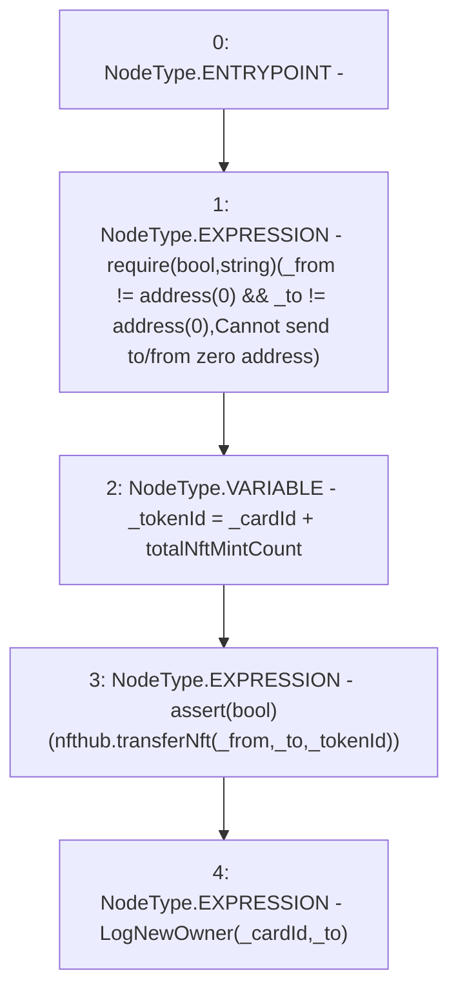

# Context: RCMarket._transferCard

**Contract:** `RCMarket` (Inherits: IRCMarket, NativeMetaTransaction, Initializable)
**Signature:** `_transferCard(address,address,uint256)`
**Method Selector ID:** `Internal (No Method ID)`
**Visibility:** `internal`
**Environment-Free:** `Yes`
**Modifiers:** None

### State Variables Interaction
- **Reads:** nfthub, totalNftMintCount
- **Writes:** None

### Assertion Checks & Business Requirements
- require/assert: `require(bool,string)(_from != address(0) && _to != address(0),Cannot send to/from zero address)`
- require/assert: `assert(bool)(nfthub.transferNft(_from,_to,_tokenId))`

### Environment & Verification Flags
- **Uses Foundry Cheatcodes:** No
- **Has Echidna Properties:** No

### Internal Calls Tree
- None

### External Calls / Value Transfers
- `IRCNftHubL2.TMP_902(bool) = HIGH_LEVEL_CALL, dest:nfthub(IRCNftHubL2), function:transferNft, arguments:['_from', '_to', '_tokenId']  `
- `TMP_900(None) = SOLIDITY_CALL require(bool,string)(TMP_899,Cannot send to/from zero address)`

### Control Flow Graph (CFG)


### Source Mapping
Declared in: `contracts/RCMarket.sol` on lines **356** to **369**

```solidity
    function _transferCard(
        address _from,
        address _to,
        uint256 _cardId
    ) internal {
        require(
            _from != address(0) && _to != address(0),
            "Cannot send to/from zero address"
        );
        uint256 _tokenId = _cardId + totalNftMintCount;

        assert(nfthub.transferNft(_from, _to, _tokenId));
        emit LogNewOwner(_cardId, _to);
    }

```
