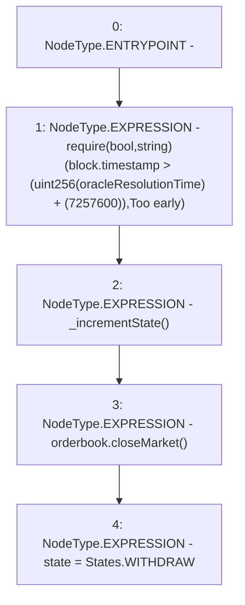

# Context: RCMarket.circuitBreaker

**Contract:** `RCMarket` (Inherits: IRCMarket, NativeMetaTransaction, Initializable)
**Signature:** `circuitBreaker()`
**Method Selector ID:** `0x16efd941`
**Visibility:** `external`
**Environment-Free:** `No (reads EVM state context)`
**Modifiers:** None

### State Variables Interaction
- **Reads:** oracleResolutionTime, orderbook
- **Writes:** state

### Assertion Checks & Business Requirements
- require/assert: `require(bool,string)(block.timestamp > (uint256(oracleResolutionTime) + (7257600)),Too early)`

### Environment & Verification Flags
- **Uses Foundry Cheatcodes:** No
- **Has Echidna Properties:** No

### Internal Calls Tree
- None

### External Calls / Value Transfers
- `IRCOrderbook.HIGH_LEVEL_CALL, dest:orderbook(IRCOrderbook), function:closeMarket, arguments:[]  `

### Control Flow Graph (CFG)


### Source Mapping
Declared in: `contracts/RCMarket.sol` on lines **1107** to **1115**

```solidity
    function circuitBreaker() external {
        require(
            block.timestamp > (uint256(oracleResolutionTime) + (12 weeks)),
            "Too early"
        );
        _incrementState();
        orderbook.closeMarket();
        state = States.WITHDRAW;
    }

```
