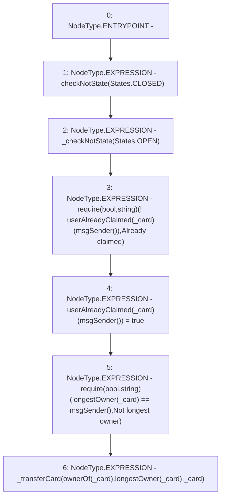

# Context: RCMarket.claimCard

**Contract:** `RCMarket` (Inherits: IRCMarket, NativeMetaTransaction, Initializable)
**Signature:** `claimCard(uint256)`
**Method Selector ID:** `0xa2ba2bb3`
**Visibility:** `external`
**Environment-Free:** `No (reads EVM state context)`
**Modifiers:** None

### State Variables Interaction
- **Reads:** longestOwner, userAlreadyClaimed
- **Writes:** userAlreadyClaimed

### Assertion Checks & Business Requirements
- require/assert: `require(bool,string)(! userAlreadyClaimed[_card][msgSender()],Already claimed)`
- require/assert: `require(bool,string)(longestOwner[_card] == msgSender(),Not longest owner)`

### Environment & Verification Flags
- **Uses Foundry Cheatcodes:** No
- **Has Echidna Properties:** No

### Internal Calls Tree
- None

### External Calls / Value Transfers
- None

### Control Flow Graph (CFG)


### Source Mapping
Declared in: `contracts/RCMarket.sol` on lines **493** to **500**

```solidity
    function claimCard(uint256 _card) external {
        _checkNotState(States.CLOSED);
        _checkNotState(States.OPEN);
        require(!userAlreadyClaimed[_card][msgSender()], "Already claimed");
        userAlreadyClaimed[_card][msgSender()] = true;
        require(longestOwner[_card] == msgSender(), "Not longest owner");
        _transferCard(ownerOf(_card), longestOwner[_card], _card);
    }

```
