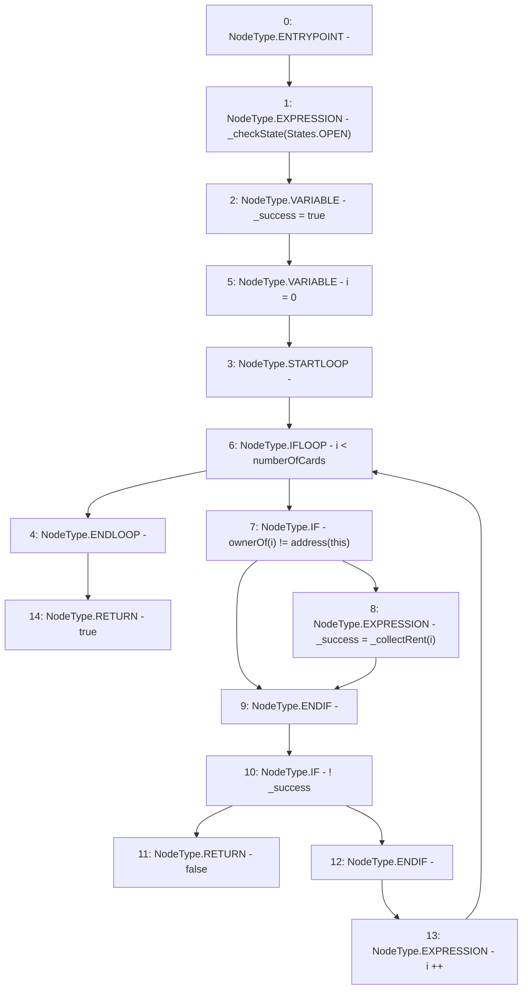

# Context: RCMarket.collectRentAllCards

**Contract:** `RCMarket` (Inherits: IRCMarket, NativeMetaTransaction, Initializable)
**Signature:** `collectRentAllCards() returns (bool)`
**Method Selector ID:** `0x605685e8`
**Visibility:** `public`
**Environment-Free:** `No (reads EVM state context)`
**Modifiers:** None

### State Variables Interaction
- **Reads:** numberOfCards
- **Writes:** None

### Environment & Verification Flags
- **Uses Foundry Cheatcodes:** No
- **Has Echidna Properties:** No

### Internal Calls Tree
- None

### External Calls / Value Transfers
- None

### Control Flow Graph (CFG)


### Source Mapping
Declared in: `contracts/RCMarket.sol` on lines **621** to **633**

```solidity
    function collectRentAllCards() public override returns (bool) {
        _checkState(States.OPEN);
        bool _success = true;
        for (uint256 i = 0; i < numberOfCards; i++) {
            if (ownerOf(i) != address(this)) {
                _success = _collectRent(i);
            }
            if (!_success) {
                return false;
            }
        }
        return true;
    }

```
