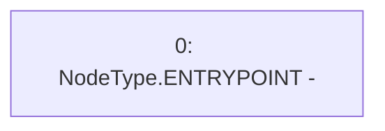

# Context: RCMarket.executeMetaTransaction

**Contract:** `RCMarket` (Inherits: IRCMarket, NativeMetaTransaction, Initializable)
**Signature:** `executeMetaTransaction(address,address,bytes,uint256,bytes,bytes)`
**Method Selector ID:** `0x7a4c6565`
**Visibility:** `external`
**Environment-Free:** `Yes`
**Modifiers:** None

### State Variables Interaction
- **Reads:** None
- **Writes:** None

### Environment & Verification Flags
- **Uses Foundry Cheatcodes:** No
- **Has Echidna Properties:** No

### Internal Calls Tree
- None

### External Calls / Value Transfers
- None

### Control Flow Graph (CFG)


### Source Mapping
Declared in: `contracts/lib/NativeMetaTransaction.sol` on lines **16** to **25**

```solidity
    function executeMetaTransaction(
        address user,
        address targets,
        bytes calldata callDatas,
        uint256 gasValues,
        bytes calldata signatures,
        bytes calldata datas
    ) external payable {
        // Stub for AST extraction
    }

```
