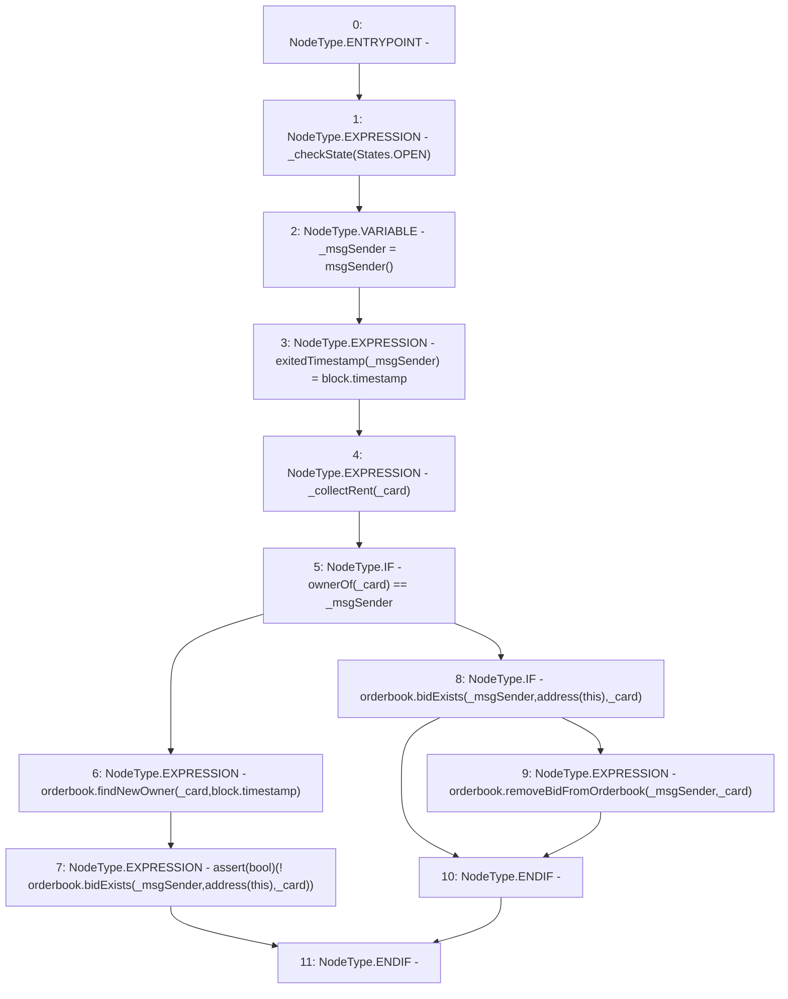

# Context: RCMarket.exit

**Contract:** `RCMarket` (Inherits: IRCMarket, NativeMetaTransaction, Initializable)
**Signature:** `exit(uint256)`
**Method Selector ID:** `0x7f8661a1`
**Visibility:** `public`
**Environment-Free:** `No (reads EVM state context)`
**Modifiers:** None

### State Variables Interaction
- **Reads:** orderbook
- **Writes:** exitedTimestamp

### Assertion Checks & Business Requirements
- require/assert: `assert(bool)(! orderbook.bidExists(_msgSender,address(this),_card))`

### Environment & Verification Flags
- **Uses Foundry Cheatcodes:** No
- **Has Echidna Properties:** No

### Internal Calls Tree
- None

### External Calls / Value Transfers
- `IRCOrderbook.HIGH_LEVEL_CALL, dest:orderbook(IRCOrderbook), function:removeBidFromOrderbook, arguments:['_msgSender', '_card']  `
- `IRCOrderbook.TMP_1131(bool) = HIGH_LEVEL_CALL, dest:orderbook(IRCOrderbook), function:bidExists, arguments:['_msgSender', 'TMP_1130', '_card']  `
- `IRCOrderbook.TMP_1125(address) = HIGH_LEVEL_CALL, dest:orderbook(IRCOrderbook), function:findNewOwner, arguments:['_card', 'block.timestamp']  `
- `IRCOrderbook.TMP_1127(bool) = HIGH_LEVEL_CALL, dest:orderbook(IRCOrderbook), function:bidExists, arguments:['_msgSender', 'TMP_1126', '_card']  `

### Control Flow Graph (CFG)


### Source Mapping
Declared in: `contracts/RCMarket.sol` on lines **784** to **804**

```solidity
    function exit(uint256 _card) public override {
        _checkState(States.OPEN);
        address _msgSender = msgSender();

        // block frontrunning attack
        exitedTimestamp[_msgSender] = block.timestamp;

        // collectRent first
        _collectRent(_card);

        if (ownerOf(_card) == _msgSender) {
            // if current owner, find a new one
            orderbook.findNewOwner(_card, block.timestamp);
            assert(!orderbook.bidExists(_msgSender, address(this), _card));
        } else {
            // if not owner, just delete from orderbook
            if (orderbook.bidExists(_msgSender, address(this), _card)) {
                orderbook.removeBidFromOrderbook(_msgSender, _card);
            }
        }
    }

```
