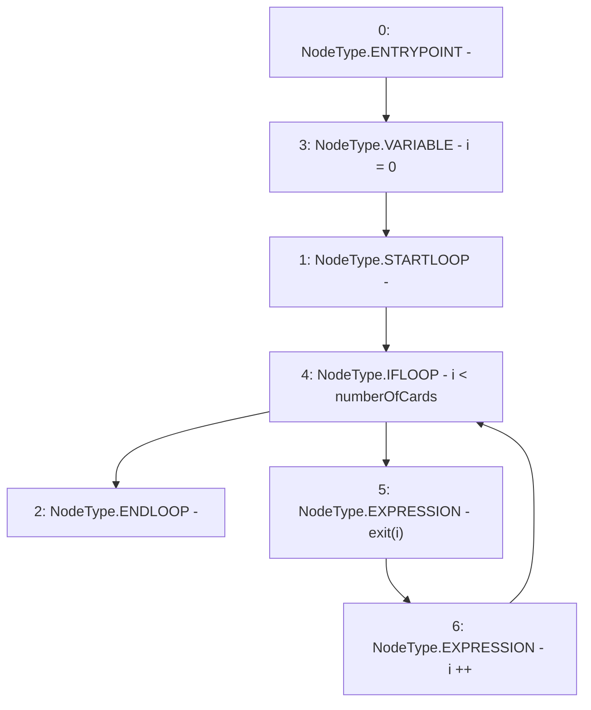

# Context: RCMarket.exitAll

**Contract:** `RCMarket` (Inherits: IRCMarket, NativeMetaTransaction, Initializable)
**Signature:** `exitAll()`
**Method Selector ID:** `0x5b6c508c`
**Visibility:** `external`
**Environment-Free:** `No (reads EVM state context)`
**Modifiers:** None

### State Variables Interaction
- **Reads:** numberOfCards
- **Writes:** None

### Environment & Verification Flags
- **Uses Foundry Cheatcodes:** No
- **Has Echidna Properties:** No

### Internal Calls Tree
- None

### External Calls / Value Transfers
- None

### Control Flow Graph (CFG)


### Source Mapping
Declared in: `contracts/RCMarket.sol` on lines **773** to **777**

```solidity
    function exitAll() external override {
        for (uint256 i = 0; i < numberOfCards; i++) {
            exit(i);
        }
    }

```
