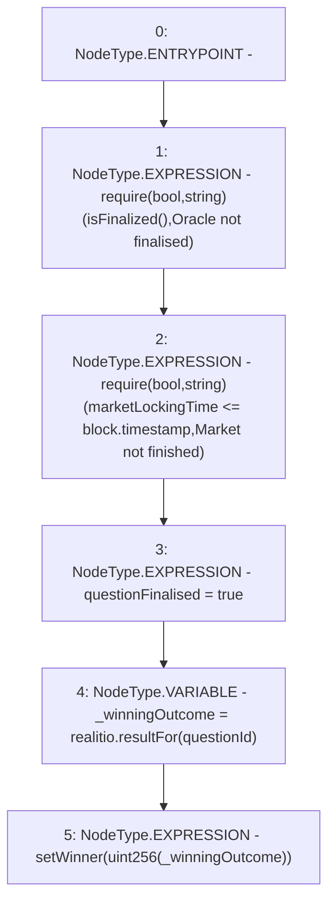

# Context: RCMarket.getWinnerFromOracle

**Contract:** `RCMarket` (Inherits: IRCMarket, NativeMetaTransaction, Initializable)
**Signature:** `getWinnerFromOracle()`
**Method Selector ID:** `0x3986192d`
**Visibility:** `external`
**Environment-Free:** `No (reads EVM state context)`
**Modifiers:** None

### State Variables Interaction
- **Reads:** marketLockingTime, questionId, realitio
- **Writes:** questionFinalised

### Assertion Checks & Business Requirements
- require/assert: `require(bool,string)(isFinalized(),Oracle not finalised)`
- require/assert: `require(bool,string)(marketLockingTime <= block.timestamp,Market not finished)`

### Environment & Verification Flags
- **Uses Foundry Cheatcodes:** No
- **Has Echidna Properties:** No

### Internal Calls Tree
- None

### External Calls / Value Transfers
- `IRealitio.TMP_920(bytes32) = HIGH_LEVEL_CALL, dest:realitio(IRealitio), function:resultFor, arguments:['questionId']  `

### Control Flow Graph (CFG)


### Source Mapping
Declared in: `contracts/RCMarket.sol` on lines **417** to **425**

```solidity
    function getWinnerFromOracle() external {
        require(isFinalized(), "Oracle not finalised");
        // check market state to prevent market closing early
        require(marketLockingTime <= block.timestamp, "Market not finished");
        questionFinalised = true;
        bytes32 _winningOutcome = realitio.resultFor(questionId);
        // call the market
        setWinner(uint256(_winningOutcome));
    }

```
