# Context: RCMarket.initialize

**Contract:** `RCMarket` (Inherits: IRCMarket, NativeMetaTransaction, Initializable)
**Signature:** `initialize(uint256,uint32[],uint256,uint256,address,address,address[],address,string)`
**Method Selector ID:** `0x6be83714`
**Visibility:** `external`
**Environment-Free:** `No (reads EVM state context)`
**Modifiers:**
- `initializer`
  ```solidity
  modifier initializer() {
          require(_initializing || !_initialized, "Initializable: contract is already initialized");
  
          bool isTopLevelCall = !_initializing;
          if (isTopLevelCall) {
              _initializing = true;
              _initialized = true;
          }
  
          _;
  
          if (isTopLevelCall) {
              _initializing = false;
          }
      }
  ```

### State Variables Interaction
- **Reads:** MAX_UINT256, affiliateCut, artistCut, cardAffiliateAddresses, cardAffiliateCut, creatorCut, factory, marketOpeningTime, minRentalDayDivisor, minimumPriceIncreasePercent, treasury, winnerCut
- **Writes:** affiliateAddress, affiliateCut, arbitrator, artistAddress, artistCut, cardAffiliateAddresses, cardAffiliateCut, creatorCut, factory, marketCreatorAddress, marketLockingTime, marketOpeningTime, maxRentIterations, minRentalDayDivisor, minimumPriceIncreasePercent, mode, nfthub, numberOfCards, oracleResolutionTime, orderbook, questionFinalised, realitio, timeout, totalNftMintCount, treasury, winnerCut, winningOutcome

### Assertion Checks & Business Requirements
- require/assert: `assert(bool)(_mode <= 2)`

### Environment & Verification Flags
- **Uses Foundry Cheatcodes:** No
- **Has Echidna Properties:** No

### Internal Calls Tree
- None

### External Calls / Value Transfers
- `IRCFactory.TMP_849(IRCOrderbook) = HIGH_LEVEL_CALL, dest:factory(IRCFactory), function:orderbook, arguments:[]  `
- `IRCFactory.TMP_850(uint256[5]) = HIGH_LEVEL_CALL, dest:factory(IRCFactory), function:getPotDistribution, arguments:[]  `
- `IRCFactory.TUPLE_4(IRealitio,address,uint32) = HIGH_LEVEL_CALL, dest:factory(IRCFactory), function:getOracleSettings, arguments:[]  `
- `IRCFactory.TMP_848(IRCNftHubL2) = HIGH_LEVEL_CALL, dest:factory(IRCFactory), function:nfthub, arguments:[]  `
- `IRCTreasury.TMP_851(uint256) = HIGH_LEVEL_CALL, dest:treasury(IRCTreasury), function:minRentalDayDivisor, arguments:[]  `
- `IRCFactory.TMP_852(uint256) = HIGH_LEVEL_CALL, dest:factory(IRCFactory), function:minimumPriceIncreasePercent, arguments:[]  `
- `IRCFactory.TMP_853(uint256) = HIGH_LEVEL_CALL, dest:factory(IRCFactory), function:maxRentIterations, arguments:[]  `
- `IRCFactory.TMP_847(IRCTreasury) = HIGH_LEVEL_CALL, dest:factory(IRCFactory), function:treasury, arguments:[]  `

### Control Flow Graph (CFG)

```mermaid
flowchart TD
    Node_0["0: NodeType.ENTRYPOINT - "]
    Node_0 --> Node_55
    Node_1["1: NodeType.EXPRESSION - assert(bool)(_mode <= 2)"]
    Node_1 --> Node_2
    Node_2["2: NodeType.EXPRESSION - _initializeEIP712(RealityCardsMarket,1)"]
    Node_2 --> Node_3
    Node_3["3: NodeType.EXPRESSION - factory = IRCFactory(msgSender())"]
    Node_3 --> Node_4
    Node_4["4: NodeType.EXPRESSION - treasury = factory.treasury()"]
    Node_4 --> Node_5
    Node_5["5: NodeType.EXPRESSION - nfthub = factory.nfthub()"]
    Node_5 --> Node_6
    Node_6["6: NodeType.EXPRESSION - orderbook = factory.orderbook()"]
    Node_6 --> Node_7
    Node_7["7: NodeType.VARIABLE - _potDistribution = factory.getPotDistribution()"]
    Node_7 --> Node_8
    Node_8["8: NodeType.EXPRESSION - minRentalDayDivisor = treasury.minRentalDayDivisor()"]
    Node_8 --> Node_9
    Node_9["9: NodeType.EXPRESSION - minimumPriceIncreasePercent = factory.minimumPriceIncreasePercent()"]
    Node_9 --> Node_10
    Node_10["10: NodeType.EXPRESSION - maxRentIterations = factory.maxRentIterations()"]
    Node_10 --> Node_11
    Node_11["11: NodeType.EXPRESSION - winningOutcome = MAX_UINT256"]
    Node_11 --> Node_12
    Node_12["12: NodeType.EXPRESSION - mode = RCMarket.Mode(_mode)"]
    Node_12 --> Node_13
    Node_13["13: NodeType.EXPRESSION - numberOfCards = _numberOfCards"]
    Node_13 --> Node_14
    Node_14["14: NodeType.EXPRESSION - totalNftMintCount = _totalNftMintCount"]
    Node_14 --> Node_15
    Node_15["15: NodeType.EXPRESSION - marketOpeningTime = _timestamps(0)"]
    Node_15 --> Node_16
    Node_16["16: NodeType.EXPRESSION - marketLockingTime = _timestamps(1)"]
    Node_16 --> Node_17
    Node_17["17: NodeType.EXPRESSION - oracleResolutionTime = _timestamps(2)"]
    Node_17 --> Node_18
    Node_18["18: NodeType.EXPRESSION - artistAddress = _artistAddress"]
    Node_18 --> Node_19
    Node_19["19: NodeType.EXPRESSION - marketCreatorAddress = _marketCreatorAddress"]
    Node_19 --> Node_20
    Node_20["20: NodeType.EXPRESSION - affiliateAddress = _affiliateAddress"]
    Node_20 --> Node_21
    Node_21["21: NodeType.EXPRESSION - cardAffiliateAddresses = _cardAffiliateAddresses"]
    Node_21 --> Node_22
    Node_22["22: NodeType.EXPRESSION - artistCut = _potDistribution(0)"]
    Node_22 --> Node_23
    Node_23["23: NodeType.EXPRESSION - winnerCut = _potDistribution(1)"]
    Node_23 --> Node_24
    Node_24["24: NodeType.EXPRESSION - creatorCut = _potDistribution(2)"]
    Node_24 --> Node_25
    Node_25["25: NodeType.EXPRESSION - affiliateCut = _potDistribution(3)"]
    Node_25 --> Node_26
    Node_26["26: NodeType.EXPRESSION - cardAffiliateCut = _potDistribution(4)"]
    Node_26 --> Node_27
    Node_27["27: NodeType.EXPRESSION - (realitio,arbitrator,timeout) = factory.getOracleSettings()"]
    Node_27 --> Node_28
    Node_28["28: NodeType.IF - _artistAddress == address(0)"]
    Node_28 --> Node_29
    Node_28 --> Node_30
    Node_29["29: NodeType.EXPRESSION - artistCut = 0"]
    Node_29 --> Node_30
    Node_30["30: NodeType.ENDIF - "]
    Node_30 --> Node_31
    Node_31["31: NodeType.IF - _affiliateAddress == address(0)"]
    Node_31 --> Node_32
    Node_31 --> Node_33
    Node_32["32: NodeType.EXPRESSION - affiliateCut = 0"]
    Node_32 --> Node_33
    Node_33["33: NodeType.ENDIF - "]
    Node_33 --> Node_34
    Node_34["34: NodeType.IF - _cardAffiliateAddresses.length == _numberOfCards"]
    Node_34 --> Node_37
    Node_34 --> Node_43
    Node_35["35: NodeType.STARTLOOP - "]
    Node_35 --> Node_38
    Node_36["36: NodeType.ENDLOOP - "]
    Node_36 --> Node_44
    Node_37["37: NodeType.VARIABLE - i = 0"]
    Node_37 --> Node_35
    Node_38["38: NodeType.IFLOOP - i < _numberOfCards"]
    Node_38 --> Node_39
    Node_38 --> Node_36
    Node_39["39: NodeType.IF - _cardAffiliateAddresses(i) == address(0)"]
    Node_39 --> Node_40
    Node_39 --> Node_41
    Node_40["40: NodeType.EXPRESSION - cardAffiliateCut = 0"]
    Node_40 --> Node_41
    Node_41["41: NodeType.ENDIF - "]
    Node_41 --> Node_42
    Node_42["42: NodeType.EXPRESSION - i ++"]
    Node_42 --> Node_38
    Node_43["43: NodeType.EXPRESSION - cardAffiliateCut = 0"]
    Node_43 --> Node_44
    Node_44["44: NodeType.ENDIF - "]
    Node_44 --> Node_45
    Node_45["45: NodeType.IF - _mode == uint8(Mode.WINNER_TAKES_ALL)"]
    Node_45 --> Node_46
    Node_45 --> Node_47
    Node_46["46: NodeType.EXPRESSION - winnerCut = (((uint256(1000) - artistCut) - creatorCut) - affiliateCut) - cardAffiliateCut"]
    Node_46 --> Node_47
    Node_47["47: NodeType.ENDIF - "]
    Node_47 --> Node_48
    Node_48["48: NodeType.EXPRESSION - questionFinalised = false"]
    Node_48 --> Node_49
    Node_49["49: NodeType.EXPRESSION - _postQuestionToOracle(_realitioQuestion,_timestamps(2))"]
    Node_49 --> Node_50
    Node_50["50: NodeType.IF - marketOpeningTime <= block.timestamp"]
    Node_50 --> Node_51
    Node_50 --> Node_52
    Node_51["51: NodeType.EXPRESSION - _incrementState()"]
    Node_51 --> Node_52
    Node_52["52: NodeType.ENDIF - "]
    Node_52 --> Node_53
    Node_53["53: NodeType.EXPRESSION - LogPayoutDetails(_artistAddress,_marketCreatorAddress,_affiliateAddress,cardAffiliateAddresses,artistCut,winnerCut,creatorCut,affiliateCut,cardAffiliateCut)"]
    Node_53 --> Node_54
    Node_54["54: NodeType.EXPRESSION - LogSettings(minRentalDayDivisor,minimumPriceIncreasePercent)"]
    Node_55["55: NodeType.EXPRESSION - initializer()"]
    Node_55 --> Node_1
```


### Source Mapping
Declared in: `contracts/RCMarket.sol` on lines **191** to **290**

```solidity
    function initialize(
        uint256 _mode,
        uint32[] memory _timestamps,
        uint256 _numberOfCards,
        uint256 _totalNftMintCount,
        address _artistAddress,
        address _affiliateAddress,
        address[] memory _cardAffiliateAddresses,
        address _marketCreatorAddress,
        string calldata _realitioQuestion
    ) external override initializer {
        assert(_mode <= 2);

        // initialise MetaTransactions
        _initializeEIP712("RealityCardsMarket", "1");

        // external contract variables:
        factory = IRCFactory(msgSender());
        treasury = factory.treasury();
        nfthub = factory.nfthub();
        orderbook = factory.orderbook();

        // get adjustable parameters from the factory/treasury
        uint256[5] memory _potDistribution = factory.getPotDistribution();
        minRentalDayDivisor = treasury.minRentalDayDivisor();
        minimumPriceIncreasePercent = factory.minimumPriceIncreasePercent();
        maxRentIterations = factory.maxRentIterations();

        // initialiiize!
        winningOutcome = MAX_UINT256; // default invalid

        // assign arguments to public variables
        mode = Mode(_mode);
        numberOfCards = _numberOfCards;
        totalNftMintCount = _totalNftMintCount;
        marketOpeningTime = _timestamps[0];
        marketLockingTime = _timestamps[1];
        oracleResolutionTime = _timestamps[2];
        artistAddress = _artistAddress;
        marketCreatorAddress = _marketCreatorAddress;
        affiliateAddress = _affiliateAddress;
        cardAffiliateAddresses = _cardAffiliateAddresses;
        artistCut = _potDistribution[0];
        winnerCut = _potDistribution[1];
        creatorCut = _potDistribution[2];
        affiliateCut = _potDistribution[3];
        cardAffiliateCut = _potDistribution[4];
        (realitio, arbitrator, timeout) = factory.getOracleSettings();

        // reduce artist cut to zero if zero adddress set
        if (_artistAddress == address(0)) {
            artistCut = 0;
        }

        // reduce affiliate cut to zero if zero adddress set
        if (_affiliateAddress == address(0)) {
            affiliateCut = 0;
        }

        // check the validity of card affiliate array.
        // if not valid, reduce payout to zero
        if (_cardAffiliateAddresses.length == _numberOfCards) {
            for (uint256 i = 0; i < _numberOfCards; i++) {
                if (_cardAffiliateAddresses[i] == address(0)) {
                    cardAffiliateCut = 0;
                }
            }
        } else {
            cardAffiliateCut = 0;
        }

        // if winner takes all mode, set winnerCut to max
        if (_mode == uint8(Mode.WINNER_TAKES_ALL)) {
            winnerCut =
                (((uint256(1000) - artistCut) - creatorCut) - affiliateCut) -
                cardAffiliateCut;
        }

        // post question to Oracle
        questionFinalised = false;
        _postQuestionToOracle(_realitioQuestion, _timestamps[2]);

        // move to OPEN immediately if market opening time in the past
        if (marketOpeningTime <= block.timestamp) {
            _incrementState();
        }

        emit LogPayoutDetails(
            _artistAddress,
            _marketCreatorAddress,
            _affiliateAddress,
            cardAffiliateAddresses,
            artistCut,
            winnerCut,
            creatorCut,
            affiliateCut,
            cardAffiliateCut
        );
        emit LogSettings(minRentalDayDivisor, minimumPriceIncreasePercent);
    }

```
