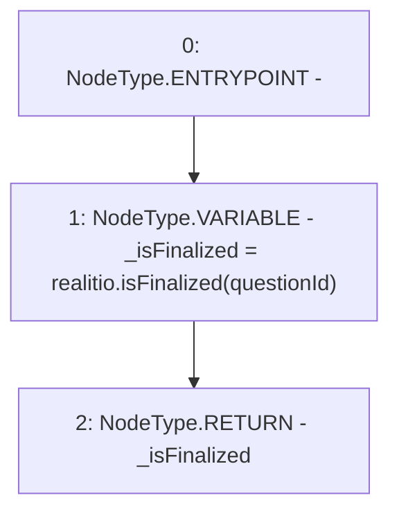

# Context: RCMarket.isFinalized

**Contract:** `RCMarket` (Inherits: IRCMarket, NativeMetaTransaction, Initializable)
**Signature:** `isFinalized() returns (bool)`
**Method Selector ID:** `0x8d4e4083`
**Visibility:** `public`
**Environment-Free:** `Yes`
**Modifiers:** None

### State Variables Interaction
- **Reads:** questionId, realitio
- **Writes:** None

### Environment & Verification Flags
- **Uses Foundry Cheatcodes:** No
- **Has Echidna Properties:** No

### Internal Calls Tree
- None

### External Calls / Value Transfers
- `IRealitio.TMP_915(bool) = HIGH_LEVEL_CALL, dest:realitio(IRealitio), function:isFinalized, arguments:['questionId']  `

### Control Flow Graph (CFG)


### Source Mapping
Declared in: `contracts/RCMarket.sol` on lines **410** to **413**

```solidity
    function isFinalized() public view returns (bool) {
        bool _isFinalized = realitio.isFinalized(questionId);
        return _isFinalized;
    }

```
