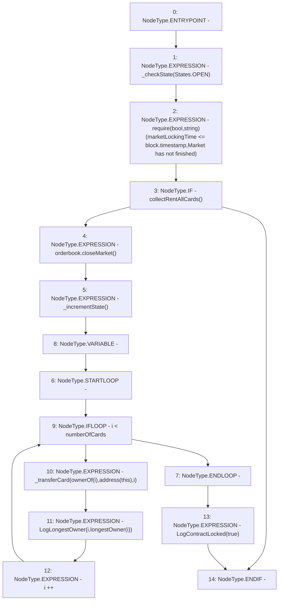

# Context: RCMarket.lockMarket

**Contract:** `RCMarket` (Inherits: IRCMarket, NativeMetaTransaction, Initializable)
**Signature:** `lockMarket()`
**Method Selector ID:** `0x9925279a`
**Visibility:** `public`
**Environment-Free:** `No (reads EVM state context)`
**Modifiers:** None

### State Variables Interaction
- **Reads:** longestOwner, marketLockingTime, numberOfCards, orderbook
- **Writes:** None

### Assertion Checks & Business Requirements
- require/assert: `require(bool,string)(marketLockingTime <= block.timestamp,Market has not finished)`

### Environment & Verification Flags
- **Uses Foundry Cheatcodes:** No
- **Has Echidna Properties:** No

### Internal Calls Tree
- None

### External Calls / Value Transfers
- `IRCOrderbook.HIGH_LEVEL_CALL, dest:orderbook(IRCOrderbook), function:closeMarket, arguments:[]  `

### Control Flow Graph (CFG)


### Source Mapping
Declared in: `contracts/RCMarket.sol` on lines **441** to **460**

```solidity
    function lockMarket() public {
        _checkState(States.OPEN);
        require(
            marketLockingTime <= block.timestamp,
            "Market has not finished"
        );
        // do a final rent collection before the contract is locked down

        if (collectRentAllCards()) {
            orderbook.closeMarket();
            _incrementState();

            for (uint256 i; i < numberOfCards; i++) {
                // bring the cards back to the market so the winners get the satisfcation of claiming them
                _transferCard(ownerOf(i), address(this), i);
                emit LogLongestOwner(i, longestOwner[i]);
            }
            emit LogContractLocked(true);
        }
    }

```
