# Context: RCMarket.newRental

**Contract:** `RCMarket` (Inherits: IRCMarket, NativeMetaTransaction, Initializable)
**Signature:** `newRental(uint256,uint256,address,uint256)`
**Method Selector ID:** `0x7f9017f8`
**Visibility:** `public`
**Environment-Free:** `No (reads EVM state context)`
**Modifiers:**
- `autoUnlock`
  ```solidity
  modifier autoUnlock() {
          if (marketOpeningTime <= block.timestamp && state == States.CLOSED) {
              _incrementState();
          }
          _;
      }
  ```
- `autoLock`
  ```solidity
  modifier autoLock() {
          _;
          if (marketLockingTime <= block.timestamp) {
              lockMarket();
          }
      }
  ```

### State Variables Interaction
- **Reads:** MIN_RENTAL_VALUE, cardPrice, exitedTimestamp, minRentalDayDivisor, minimumPriceIncreasePercent, numberOfCards, orderbook, state, treasury
- **Writes:** None

### Assertion Checks & Business Requirements
- require/assert: `require(bool,string)(_newPrice >= MIN_RENTAL_VALUE,Price below min)`
- require/assert: `require(bool,string)(_card < numberOfCards,Card does not exist)`
- require/assert: `require(bool,string)(exitedTimestamp[_user] != block.timestamp,Cannot lose and re-rent in same block)`
- require/assert: `require(bool,string)(! treasury.marketPaused(address(this)) && ! treasury.globalPause(),Rentals are disabled)`
- require/assert: `require(bool,string)(_newPrice >= _requiredPrice || _newPrice < cardPrice[_card],Invalid price)`
- require/assert: `require(bool,string)(treasury.userDeposit(_user) >= _userTotalBidRate / minRentalDayDivisor,Insufficient deposit)`
- require/assert: `assert(bool)(treasury.updateLastRentalTime(_user))`

### Environment & Verification Flags
- **Uses Foundry Cheatcodes:** No
- **Has Echidna Properties:** No

### Internal Calls Tree
- None

### External Calls / Value Transfers
- `IRCOrderbook.HIGH_LEVEL_CALL, dest:orderbook(IRCOrderbook), function:addBidToOrderbook, arguments:['_user', '_card', '_newPrice', '_timeHeldLimit', '_startingPosition']  `
- `IRCTreasury.TMP_1070(bool) = HIGH_LEVEL_CALL, dest:treasury(IRCTreasury), function:marketPaused, arguments:['TMP_1069']  `
- `IRCTreasury.TMP_1090(uint256) = HIGH_LEVEL_CALL, dest:treasury(IRCTreasury), function:userTotalBids, arguments:['_user']  `
- `IRCOrderbook.TMP_1077(bool) = HIGH_LEVEL_CALL, dest:orderbook(IRCOrderbook), function:removeUserFromOrderbook, arguments:['_user']  `
- `IRCTreasury.TMP_1094(uint256) = HIGH_LEVEL_CALL, dest:treasury(IRCTreasury), function:userDeposit, arguments:['_user']  `
- `IRCOrderbook.TMP_1091(uint256) = HIGH_LEVEL_CALL, dest:orderbook(IRCOrderbook), function:getBidValue, arguments:['_user', '_card']  `
- `IRCTreasury.TMP_1076(bool) = HIGH_LEVEL_CALL, dest:treasury(IRCTreasury), function:isForeclosed, arguments:['_user']  `
- `IRCTreasury.TMP_1072(bool) = HIGH_LEVEL_CALL, dest:treasury(IRCTreasury), function:globalPause, arguments:[]  `
- `IRCOrderbook.HIGH_LEVEL_CALL, dest:orderbook(IRCOrderbook), function:removeOldBids, arguments:['_user']  `
- `IRCTreasury.TMP_1100(bool) = HIGH_LEVEL_CALL, dest:treasury(IRCTreasury), function:updateLastRentalTime, arguments:['_user']  `

### Control Flow Graph (CFG)

```mermaid
flowchart TD
    Node_0["0: NodeType.ENTRYPOINT - "]
    Node_0 --> Node_25
    Node_1["1: NodeType.IF - state == States.OPEN"]
    Node_1 --> Node_2
    Node_1 --> Node_24
    Node_2["2: NodeType.EXPRESSION - require(bool,string)(_newPrice >= MIN_RENTAL_VALUE,Price below min)"]
    Node_2 --> Node_3
    Node_3["3: NodeType.EXPRESSION - require(bool,string)(_card < numberOfCards,Card does not exist)"]
    Node_3 --> Node_4
    Node_4["4: NodeType.VARIABLE - _user = msgSender()"]
    Node_4 --> Node_5
    Node_5["5: NodeType.EXPRESSION - require(bool,string)(exitedTimestamp(_user) != block.timestamp,Cannot lose and re-rent in same block)"]
    Node_5 --> Node_6
    Node_6["6: NodeType.EXPRESSION - require(bool,string)(! treasury.marketPaused(address(this)) && ! treasury.globalPause(),Rentals are disabled)"]
    Node_6 --> Node_7
    Node_7["7: NodeType.VARIABLE - _userStillForeclosed = treasury.isForeclosed(_user)"]
    Node_7 --> Node_8
    Node_8["8: NodeType.IF - _userStillForeclosed"]
    Node_8 --> Node_9
    Node_8 --> Node_10
    Node_9["9: NodeType.EXPRESSION - _userStillForeclosed = orderbook.removeUserFromOrderbook(_user)"]
    Node_9 --> Node_10
    Node_10["10: NodeType.ENDIF - "]
    Node_10 --> Node_11
    Node_11["11: NodeType.IF - ! _userStillForeclosed"]
    Node_11 --> Node_12
    Node_11 --> Node_23
    Node_12["12: NodeType.IF - ownerOf(_card) == _user"]
    Node_12 --> Node_13
    Node_12 --> Node_15
    Node_13["13: NodeType.VARIABLE - _requiredPrice = (cardPrice(_card) * (minimumPriceIncreasePercent + 100)) / (100)"]
    Node_13 --> Node_14
    Node_14["14: NodeType.EXPRESSION - require(bool,string)(_newPrice >= _requiredPrice || _newPrice < cardPrice(_card),Invalid price)"]
    Node_14 --> Node_15
    Node_15["15: NodeType.ENDIF - "]
    Node_15 --> Node_16
    Node_16["16: NodeType.EXPRESSION - orderbook.removeOldBids(_user)"]
    Node_16 --> Node_17
    Node_17["17: NodeType.EXPRESSION - _collectRent(_card)"]
    Node_17 --> Node_18
    Node_18["18: NodeType.VARIABLE - _userTotalBidRate = treasury.userTotalBids(_user) - (orderbook.getBidValue(_user,_card)) + _newPrice"]
    Node_18 --> Node_19
    Node_19["19: NodeType.EXPRESSION - require(bool,string)(treasury.userDeposit(_user) >= _userTotalBidRate / minRentalDayDivisor,Insufficient deposit)"]
    Node_19 --> Node_20
    Node_20["20: NodeType.EXPRESSION - _timeHeldLimit = _checkTimeHeldLimit(_timeHeldLimit)"]
    Node_20 --> Node_21
    Node_21["21: NodeType.EXPRESSION - orderbook.addBidToOrderbook(_user,_card,_newPrice,_timeHeldLimit,_startingPosition)"]
    Node_21 --> Node_22
    Node_22["22: NodeType.EXPRESSION - assert(bool)(treasury.updateLastRentalTime(_user))"]
    Node_22 --> Node_23
    Node_23["23: NodeType.ENDIF - "]
    Node_23 --> Node_24
    Node_24["24: NodeType.ENDIF - "]
    Node_25["25: NodeType.EXPRESSION - autoUnlock()"]
    Node_25 --> Node_26
    Node_26["26: NodeType.EXPRESSION - autoLock()"]
    Node_26 --> Node_1
```


### Source Mapping
Declared in: `contracts/RCMarket.sol` on lines **666** to **734**

```solidity
    function newRental(
        uint256 _newPrice,
        uint256 _timeHeldLimit,
        address _startingPosition,
        uint256 _card
    ) public autoUnlock() autoLock() {
        if (state == States.OPEN) {
            require(_newPrice >= MIN_RENTAL_VALUE, "Price below min");
            require(_card < numberOfCards, "Card does not exist");

            address _user = msgSender();

            require(
                exitedTimestamp[_user] != block.timestamp,
                "Cannot lose and re-rent in same block"
            );
            require(
                !treasury.marketPaused(address(this)) &&
                    !treasury.globalPause(),
                "Rentals are disabled"
            );
            bool _userStillForeclosed = treasury.isForeclosed(_user);
            if (_userStillForeclosed) {
                _userStillForeclosed = orderbook.removeUserFromOrderbook(_user);
            }
            if (!_userStillForeclosed) {
                if (ownerOf(_card) == _user) {
                    // the owner may only increase by more than X% or reduce their price
                    uint256 _requiredPrice =
                        (cardPrice[_card] *
                            (minimumPriceIncreasePercent + 100)) / (100);
                    require(
                        _newPrice >= _requiredPrice ||
                            _newPrice < cardPrice[_card],
                        "Invalid price"
                    );
                }

                // do some cleaning up before we collect rent or check their bidRate
                orderbook.removeOldBids(_user);

                _collectRent(_card);

                // check sufficient deposit
                uint256 _userTotalBidRate =
                    treasury.userTotalBids(_user) -
                        (orderbook.getBidValue(_user, _card)) +
                        _newPrice;
                require(
                    treasury.userDeposit(_user) >=
                        _userTotalBidRate / minRentalDayDivisor,
                    "Insufficient deposit"
                );

                _timeHeldLimit = _checkTimeHeldLimit(_timeHeldLimit);

                // replaces _newBid and _updateBid
                orderbook.addBidToOrderbook(
                    _user,
                    _card,
                    _newPrice,
                    _timeHeldLimit,
                    _startingPosition
                );

                assert(treasury.updateLastRentalTime(_user));
            }
        }
    }

```
