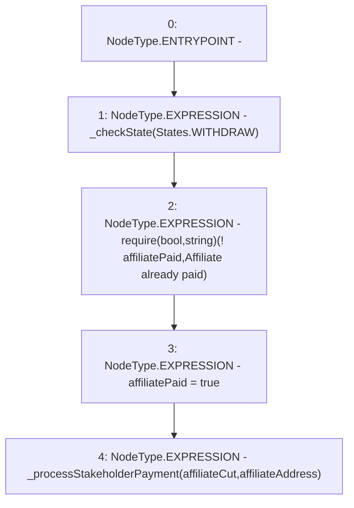

# Context: RCMarket.payAffiliate

**Contract:** `RCMarket` (Inherits: IRCMarket, NativeMetaTransaction, Initializable)
**Signature:** `payAffiliate()`
**Method Selector ID:** `0x91cef6a8`
**Visibility:** `external`
**Environment-Free:** `Yes`
**Modifiers:** None

### State Variables Interaction
- **Reads:** affiliateAddress, affiliateCut, affiliatePaid
- **Writes:** affiliatePaid

### Assertion Checks & Business Requirements
- require/assert: `require(bool,string)(! affiliatePaid,Affiliate already paid)`

### Environment & Verification Flags
- **Uses Foundry Cheatcodes:** No
- **Has Echidna Properties:** No

### Internal Calls Tree
- None

### External Calls / Value Transfers
- None

### Control Flow Graph (CFG)


### Source Mapping
Declared in: `contracts/RCMarket.sol` on lines **577** to **582**

```solidity
    function payAffiliate() external {
        _checkState(States.WITHDRAW);
        require(!affiliatePaid, "Affiliate already paid");
        affiliatePaid = true;
        _processStakeholderPayment(affiliateCut, affiliateAddress);
    }

```
