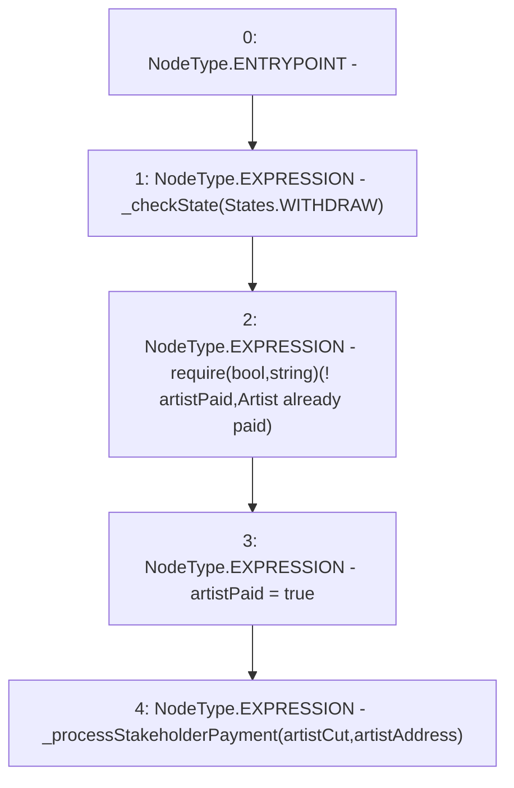

# Context: RCMarket.payArtist

**Contract:** `RCMarket` (Inherits: IRCMarket, NativeMetaTransaction, Initializable)
**Signature:** `payArtist()`
**Method Selector ID:** `0x734c8f80`
**Visibility:** `external`
**Environment-Free:** `Yes`
**Modifiers:** None

### State Variables Interaction
- **Reads:** artistAddress, artistCut, artistPaid
- **Writes:** artistPaid

### Assertion Checks & Business Requirements
- require/assert: `require(bool,string)(! artistPaid,Artist already paid)`

### Environment & Verification Flags
- **Uses Foundry Cheatcodes:** No
- **Has Echidna Properties:** No

### Internal Calls Tree
- None

### External Calls / Value Transfers
- None

### Control Flow Graph (CFG)


### Source Mapping
Declared in: `contracts/RCMarket.sol` on lines **560** to **565**

```solidity
    function payArtist() external {
        _checkState(States.WITHDRAW);
        require(!artistPaid, "Artist already paid");
        artistPaid = true;
        _processStakeholderPayment(artistCut, artistAddress);
    }

```
