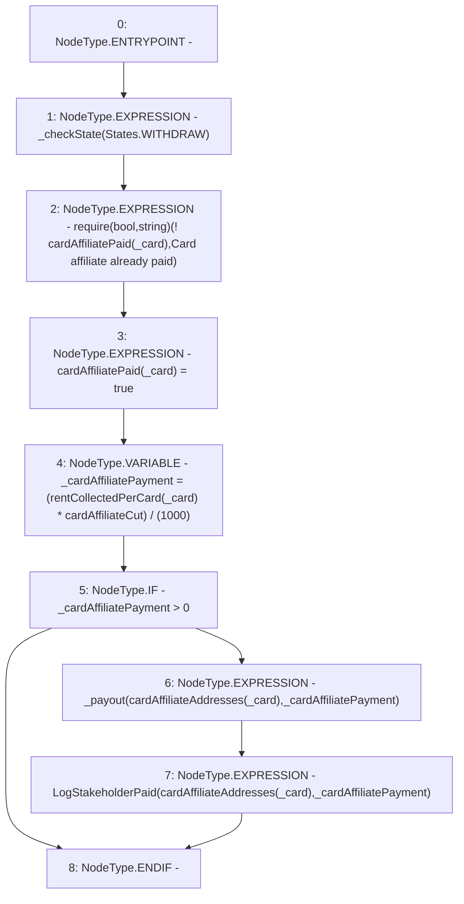

# Context: RCMarket.payCardAffiliate

**Contract:** `RCMarket` (Inherits: IRCMarket, NativeMetaTransaction, Initializable)
**Signature:** `payCardAffiliate(uint256)`
**Method Selector ID:** `0x0da400cf`
**Visibility:** `external`
**Environment-Free:** `Yes`
**Modifiers:** None

### State Variables Interaction
- **Reads:** cardAffiliateAddresses, cardAffiliateCut, cardAffiliatePaid, rentCollectedPerCard
- **Writes:** cardAffiliatePaid

### Assertion Checks & Business Requirements
- require/assert: `require(bool,string)(! cardAffiliatePaid[_card],Card affiliate already paid)`

### Environment & Verification Flags
- **Uses Foundry Cheatcodes:** No
- **Has Echidna Properties:** No

### Internal Calls Tree
- None

### External Calls / Value Transfers
- None

### Control Flow Graph (CFG)


### Source Mapping
Declared in: `contracts/RCMarket.sol` on lines **586** to **599**

```solidity
    function payCardAffiliate(uint256 _card) external {
        _checkState(States.WITHDRAW);
        require(!cardAffiliatePaid[_card], "Card affiliate already paid");
        cardAffiliatePaid[_card] = true;
        uint256 _cardAffiliatePayment =
            (rentCollectedPerCard[_card] * cardAffiliateCut) / (1000);
        if (_cardAffiliatePayment > 0) {
            _payout(cardAffiliateAddresses[_card], _cardAffiliatePayment);
            emit LogStakeholderPaid(
                cardAffiliateAddresses[_card],
                _cardAffiliatePayment
            );
        }
    }

```
