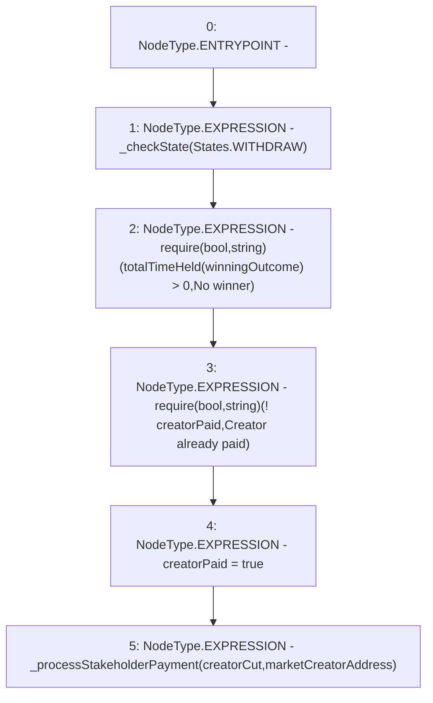

# Context: RCMarket.payMarketCreator

**Contract:** `RCMarket` (Inherits: IRCMarket, NativeMetaTransaction, Initializable)
**Signature:** `payMarketCreator()`
**Method Selector ID:** `0xec80a92c`
**Visibility:** `external`
**Environment-Free:** `Yes`
**Modifiers:** None

### State Variables Interaction
- **Reads:** creatorCut, creatorPaid, marketCreatorAddress, totalTimeHeld, winningOutcome
- **Writes:** creatorPaid

### Assertion Checks & Business Requirements
- require/assert: `require(bool,string)(totalTimeHeld[winningOutcome] > 0,No winner)`
- require/assert: `require(bool,string)(! creatorPaid,Creator already paid)`

### Environment & Verification Flags
- **Uses Foundry Cheatcodes:** No
- **Has Echidna Properties:** No

### Internal Calls Tree
- None

### External Calls / Value Transfers
- None

### Control Flow Graph (CFG)


### Source Mapping
Declared in: `contracts/RCMarket.sol` on lines **568** to **574**

```solidity
    function payMarketCreator() external {
        _checkState(States.WITHDRAW);
        require(totalTimeHeld[winningOutcome] > 0, "No winner");
        require(!creatorPaid, "Creator already paid");
        creatorPaid = true;
        _processStakeholderPayment(creatorCut, marketCreatorAddress);
    }

```
