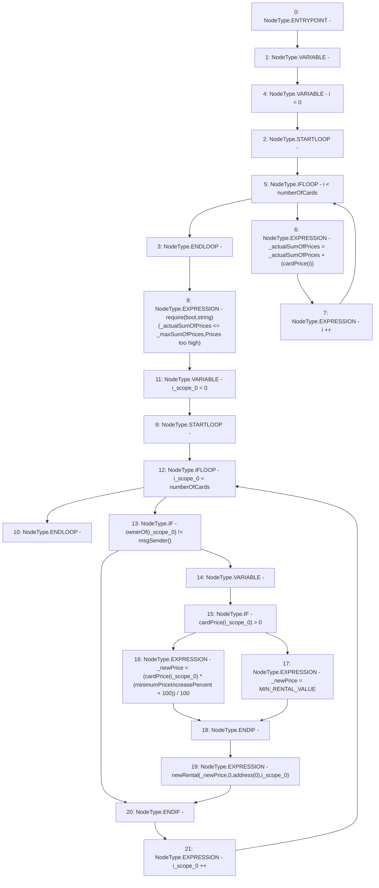

# Context: RCMarket.rentAllCards

**Contract:** `RCMarket` (Inherits: IRCMarket, NativeMetaTransaction, Initializable)
**Signature:** `rentAllCards(uint256)`
**Method Selector ID:** `0xfd7b7711`
**Visibility:** `external`
**Environment-Free:** `No (reads EVM state context)`
**Modifiers:** None

### State Variables Interaction
- **Reads:** MIN_RENTAL_VALUE, cardPrice, minimumPriceIncreasePercent, numberOfCards
- **Writes:** None

### Assertion Checks & Business Requirements
- require/assert: `require(bool,string)(_actualSumOfPrices <= _maxSumOfPrices,Prices too high)`

### Environment & Verification Flags
- **Uses Foundry Cheatcodes:** No
- **Has Echidna Properties:** No

### Internal Calls Tree
- None

### External Calls / Value Transfers
- None

### Control Flow Graph (CFG)


### Source Mapping
Declared in: `contracts/RCMarket.sol` on lines **637** to **658**

```solidity
    function rentAllCards(uint256 _maxSumOfPrices) external {
        // check that not being front run
        uint256 _actualSumOfPrices;
        for (uint256 i = 0; i < numberOfCards; i++) {
            _actualSumOfPrices = _actualSumOfPrices + (cardPrice[i]);
        }
        require(_actualSumOfPrices <= _maxSumOfPrices, "Prices too high");

        for (uint256 i = 0; i < numberOfCards; i++) {
            if (ownerOf(i) != msgSender()) {
                uint256 _newPrice;
                if (cardPrice[i] > 0) {
                    _newPrice =
                        (cardPrice[i] * (minimumPriceIncreasePercent + 100)) /
                        100;
                } else {
                    _newPrice = MIN_RENTAL_VALUE;
                }
                newRental(_newPrice, 0, address(0), i);
            }
        }
    }

```
