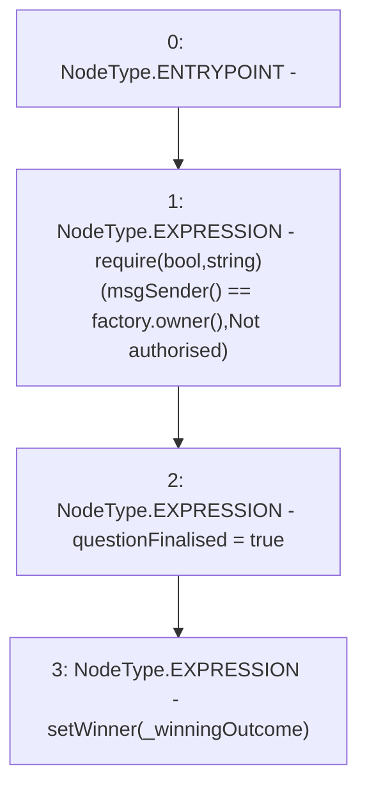

# Context: RCMarket.setAmicableResolution

**Contract:** `RCMarket` (Inherits: IRCMarket, NativeMetaTransaction, Initializable)
**Signature:** `setAmicableResolution(uint256)`
**Method Selector ID:** `0xdb4e116b`
**Visibility:** `external`
**Environment-Free:** `No (reads EVM state context)`
**Modifiers:** None

### State Variables Interaction
- **Reads:** factory
- **Writes:** questionFinalised

### Assertion Checks & Business Requirements
- require/assert: `require(bool,string)(msgSender() == factory.owner(),Not authorised)`

### Environment & Verification Flags
- **Uses Foundry Cheatcodes:** No
- **Has Echidna Properties:** No

### Internal Calls Tree
- None

### External Calls / Value Transfers
- `IRCFactory.TMP_924(address) = HIGH_LEVEL_CALL, dest:factory(IRCFactory), function:owner, arguments:[]  `

### Control Flow Graph (CFG)


### Source Mapping
Declared in: `contracts/RCMarket.sol` on lines **428** to **432**

```solidity
    function setAmicableResolution(uint256 _winningOutcome) external {
        require(msgSender() == factory.owner(), "Not authorised");
        questionFinalised = true;
        setWinner(_winningOutcome);
    }

```
