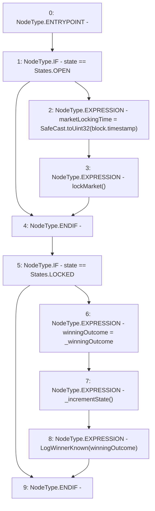

# Context: RCMarket.setWinner

**Contract:** `RCMarket` (Inherits: IRCMarket, NativeMetaTransaction, Initializable)
**Signature:** `setWinner(uint256)`
**Method Selector ID:** `Internal (No Method ID)`
**Visibility:** `internal`
**Environment-Free:** `No (reads EVM state context)`
**Modifiers:** None

### State Variables Interaction
- **Reads:** state, winningOutcome
- **Writes:** marketLockingTime, winningOutcome

### Environment & Verification Flags
- **Uses Foundry Cheatcodes:** No
- **Has Echidna Properties:** No

### Internal Calls Tree
- None

### External Calls / Value Transfers
- `SafeCast.TMP_942(uint32) = LIBRARY_CALL, dest:SafeCast, function:SafeCast.toUint32(uint256), arguments:['block.timestamp'] `

### Control Flow Graph (CFG)


### Source Mapping
Declared in: `contracts/RCMarket.sol` on lines **464** to **476**

```solidity
    function setWinner(uint256 _winningOutcome) internal {
        if (state == States.OPEN) {
            // change the locking time to allow lockMarket to lock
            marketLockingTime = SafeCast.toUint32(block.timestamp);
            lockMarket();
        }
        if (state == States.LOCKED) {
            // get the winner. This will revert if answer is not resolved.
            winningOutcome = _winningOutcome;
            _incrementState();
            emit LogWinnerKnown(winningOutcome);
        }
    }

```
