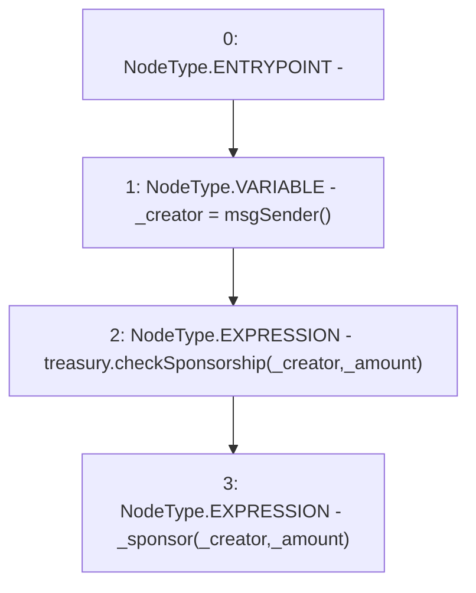

# Context: RCMarket.sponsor

**Contract:** `RCMarket` (Inherits: IRCMarket, NativeMetaTransaction, Initializable)
**Signature:** `sponsor(uint256)`
**Method Selector ID:** `0xb6cce5e2`
**Visibility:** `external`
**Environment-Free:** `No (reads EVM state context)`
**Modifiers:** None

### State Variables Interaction
- **Reads:** treasury
- **Writes:** None

### Environment & Verification Flags
- **Uses Foundry Cheatcodes:** No
- **Has Echidna Properties:** No

### Internal Calls Tree
- None

### External Calls / Value Transfers
- `IRCTreasury.HIGH_LEVEL_CALL, dest:treasury(IRCTreasury), function:checkSponsorship, arguments:['_creator', '_amount']  `

### Control Flow Graph (CFG)


### Source Mapping
Declared in: `contracts/RCMarket.sol` on lines **808** to **812**

```solidity
    function sponsor(uint256 _amount) external override {
        address _creator = msgSender();
        treasury.checkSponsorship(_creator, _amount);
        _sponsor(_creator, _amount);
    }

```
