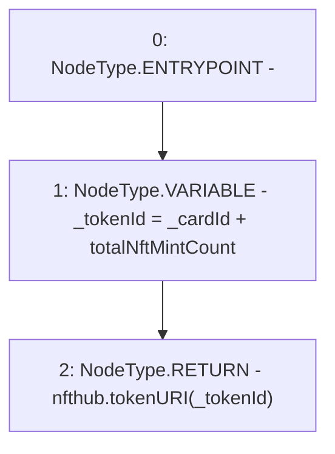

# Context: RCMarket.tokenURI

**Contract:** `RCMarket` (Inherits: IRCMarket, NativeMetaTransaction, Initializable)
**Signature:** `tokenURI(uint256) returns (string)`
**Method Selector ID:** `0xc87b56dd`
**Visibility:** `public`
**Environment-Free:** `Yes`
**Modifiers:** None

### State Variables Interaction
- **Reads:** nfthub, totalNftMintCount
- **Writes:** None

### Environment & Verification Flags
- **Uses Foundry Cheatcodes:** No
- **Has Echidna Properties:** No

### Internal Calls Tree
- None

### External Calls / Value Transfers
- `IRCNftHubL2.TMP_894(string) = HIGH_LEVEL_CALL, dest:nfthub(IRCNftHubL2), function:tokenURI, arguments:['_tokenId']  `

### Control Flow Graph (CFG)


### Source Mapping
Declared in: `contracts/RCMarket.sol` on lines **344** to **352**

```solidity
    function tokenURI(uint256 _cardId)
        public
        view
        override
        returns (string memory)
    {
        uint256 _tokenId = _cardId + totalNftMintCount;
        return nfthub.tokenURI(_tokenId);
    }

```
