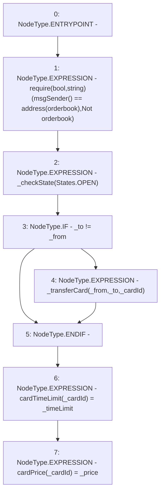

# Context: RCMarket.transferCard

**Contract:** `RCMarket` (Inherits: IRCMarket, NativeMetaTransaction, Initializable)
**Signature:** `transferCard(address,address,uint256,uint256,uint256)`
**Method Selector ID:** `0x060982d4`
**Visibility:** `external`
**Environment-Free:** `No (reads EVM state context)`
**Modifiers:** None

### State Variables Interaction
- **Reads:** orderbook
- **Writes:** cardPrice, cardTimeLimit

### Assertion Checks & Business Requirements
- require/assert: `require(bool,string)(msgSender() == address(orderbook),Not orderbook)`

### Environment & Verification Flags
- **Uses Foundry Cheatcodes:** No
- **Has Echidna Properties:** No

### Internal Calls Tree
- None

### External Calls / Value Transfers
- None

### Control Flow Graph (CFG)


### Source Mapping
Declared in: `contracts/RCMarket.sol` on lines **373** to **387**

```solidity
    function transferCard(
        address _from,
        address _to,
        uint256 _cardId,
        uint256 _price,
        uint256 _timeLimit
    ) external override {
        require(msgSender() == address(orderbook), "Not orderbook");
        _checkState(States.OPEN);
        if (_to != _from) {
            _transferCard(_from, _to, _cardId);
        }
        cardTimeLimit[_cardId] = _timeLimit;
        cardPrice[_cardId] = _price;
    }

```
