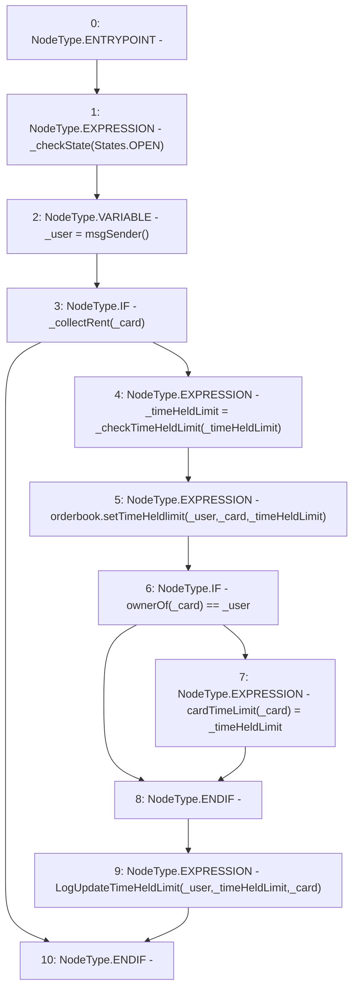

# Context: RCMarket.updateTimeHeldLimit

**Contract:** `RCMarket` (Inherits: IRCMarket, NativeMetaTransaction, Initializable)
**Signature:** `updateTimeHeldLimit(uint256,uint256)`
**Method Selector ID:** `0x86620850`
**Visibility:** `external`
**Environment-Free:** `No (reads EVM state context)`
**Modifiers:** None

### State Variables Interaction
- **Reads:** orderbook
- **Writes:** cardTimeLimit

### Environment & Verification Flags
- **Uses Foundry Cheatcodes:** No
- **Has Echidna Properties:** No

### Internal Calls Tree
- None

### External Calls / Value Transfers
- `IRCOrderbook.HIGH_LEVEL_CALL, dest:orderbook(IRCOrderbook), function:setTimeHeldlimit, arguments:['_user', '_card', '_timeHeldLimit']  `

### Control Flow Graph (CFG)


### Source Mapping
Declared in: `contracts/RCMarket.sol` on lines **753** to **770**

```solidity
    function updateTimeHeldLimit(uint256 _timeHeldLimit, uint256 _card)
        external
    {
        _checkState(States.OPEN);
        address _user = msgSender();

        if (_collectRent(_card)) {
            _timeHeldLimit = _checkTimeHeldLimit(_timeHeldLimit);

            orderbook.setTimeHeldlimit(_user, _card, _timeHeldLimit);

            if (ownerOf(_card) == _user) {
                cardTimeLimit[_card] = _timeHeldLimit;
            }

            emit LogUpdateTimeHeldLimit(_user, _timeHeldLimit, _card);
        }
    }

```
