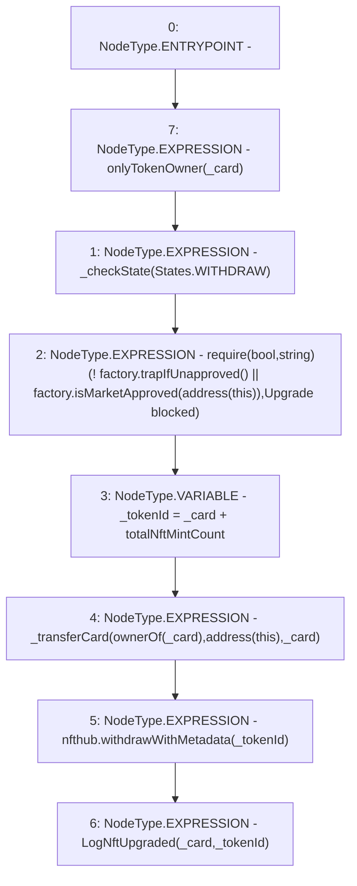

# Context: RCMarket.upgradeCard

**Contract:** `RCMarket` (Inherits: IRCMarket, NativeMetaTransaction, Initializable)
**Signature:** `upgradeCard(uint256)`
**Method Selector ID:** `0xa16db5b5`
**Visibility:** `external`
**Environment-Free:** `No (reads EVM state context)`
**Modifiers:**
- `onlyTokenOwner`
  ```solidity
  modifier onlyTokenOwner(uint256 _token) {
          require(msgSender() == ownerOf(_token), "Not owner");
          _;
      }
  ```

### State Variables Interaction
- **Reads:** factory, nfthub, totalNftMintCount
- **Writes:** None

### Assertion Checks & Business Requirements
- require/assert: `require(bool,string)(! factory.trapIfUnapproved() || factory.isMarketApproved(address(this)),Upgrade blocked)`

### Environment & Verification Flags
- **Uses Foundry Cheatcodes:** No
- **Has Echidna Properties:** No

### Internal Calls Tree
- None

### External Calls / Value Transfers
- `IRCNftHubL2.HIGH_LEVEL_CALL, dest:nfthub(IRCNftHubL2), function:withdrawWithMetadata, arguments:['_tokenId']  `
- `IRCFactory.TMP_878(bool) = HIGH_LEVEL_CALL, dest:factory(IRCFactory), function:trapIfUnapproved, arguments:[]  `
- `IRCFactory.TMP_881(bool) = HIGH_LEVEL_CALL, dest:factory(IRCFactory), function:isMarketApproved, arguments:['TMP_880']  `

### Control Flow Graph (CFG)


### Source Mapping
Declared in: `contracts/RCMarket.sol` on lines **324** to **335**

```solidity
    function upgradeCard(uint256 _card) external onlyTokenOwner(_card) {
        _checkState(States.WITHDRAW);
        require(
            !factory.trapIfUnapproved() ||
                factory.isMarketApproved(address(this)),
            "Upgrade blocked"
        );
        uint256 _tokenId = _card + totalNftMintCount;
        _transferCard(ownerOf(_card), address(this), _card); // contract becomes final resting place
        nfthub.withdrawWithMetadata(_tokenId);
        emit LogNftUpgraded(_card, _tokenId);
    }

```
