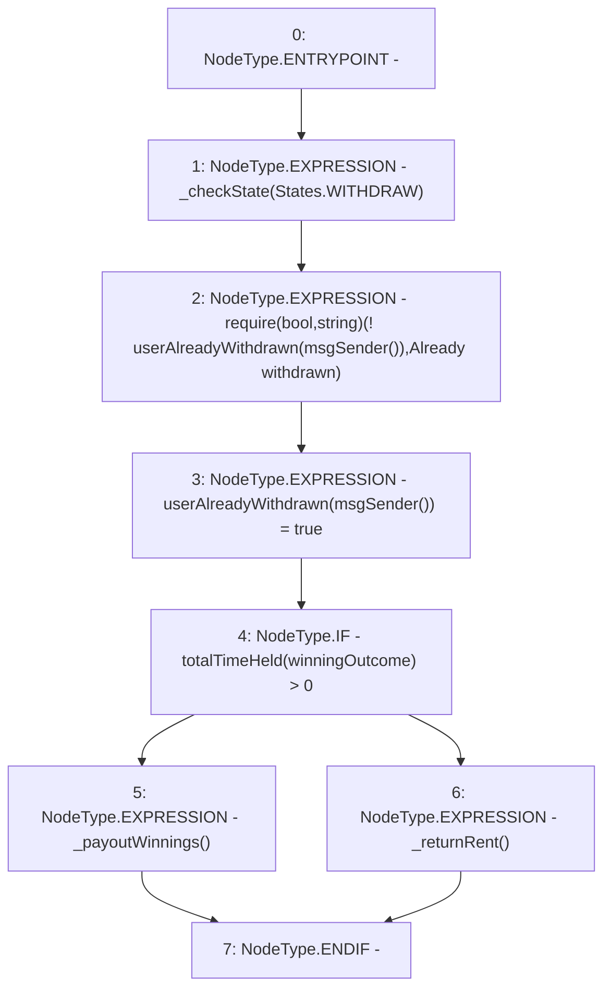

# Context: RCMarket.withdraw

**Contract:** `RCMarket` (Inherits: IRCMarket, NativeMetaTransaction, Initializable)
**Signature:** `withdraw()`
**Method Selector ID:** `0x3ccfd60b`
**Visibility:** `external`
**Environment-Free:** `No (reads EVM state context)`
**Modifiers:** None

### State Variables Interaction
- **Reads:** totalTimeHeld, userAlreadyWithdrawn, winningOutcome
- **Writes:** userAlreadyWithdrawn

### Assertion Checks & Business Requirements
- require/assert: `require(bool,string)(! userAlreadyWithdrawn[msgSender()],Already withdrawn)`

### Environment & Verification Flags
- **Uses Foundry Cheatcodes:** No
- **Has Echidna Properties:** No

### Internal Calls Tree
- None

### External Calls / Value Transfers
- None

### Control Flow Graph (CFG)


### Source Mapping
Declared in: `contracts/RCMarket.sol` on lines **479** to **488**

```solidity
    function withdraw() external {
        _checkState(States.WITHDRAW);
        require(!userAlreadyWithdrawn[msgSender()], "Already withdrawn");
        userAlreadyWithdrawn[msgSender()] = true;
        if (totalTimeHeld[winningOutcome] > 0) {
            _payoutWinnings();
        } else {
            _returnRent();
        }
    }

```
