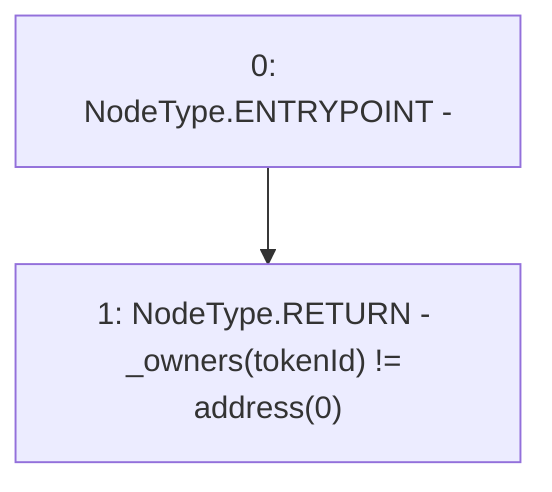

# Context: RCNftHubL1._exists

**Contract:** `RCNftHubL1` (Inherits: IRCNftHubL1, NativeMetaTransaction, AccessControl, ERC721URIStorage, ERC721, IERC721Metadata, IERC721, ERC165, IERC165, IAccessControl, Ownable, Context)
**Signature:** `_exists(uint256) returns (bool)`
**Method Selector ID:** `Internal (No Method ID)`
**Visibility:** `internal`
**Environment-Free:** `Yes`
**Modifiers:** None

### State Variables Interaction
- **Reads:** _owners
- **Writes:** None

### Environment & Verification Flags
- **Uses Foundry Cheatcodes:** No
- **Has Echidna Properties:** No

### Internal Calls Tree
- None

### External Calls / Value Transfers
- None

### Control Flow Graph (CFG)


### Source Mapping
Declared in: `node_modules/@openzeppelin/contracts/token/ERC721/ERC721.sol` on lines **204** to **206**

```solidity
    function _exists(uint256 tokenId) internal view virtual returns (bool) {
        return _owners[tokenId] != address(0);
    }

```
