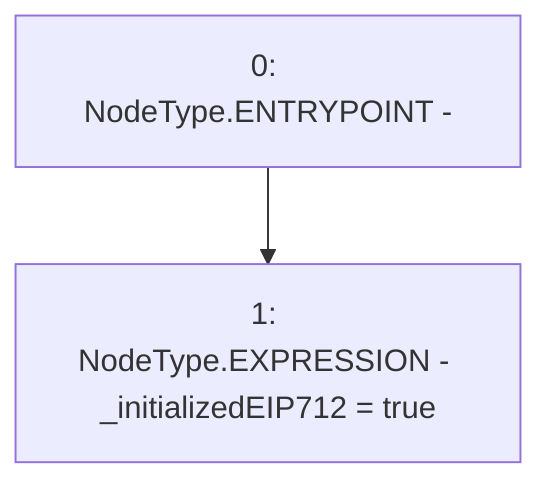

# Context: RCNftHubL1._initializeEIP712

**Contract:** `RCNftHubL1` (Inherits: IRCNftHubL1, NativeMetaTransaction, AccessControl, ERC721URIStorage, ERC721, IERC721Metadata, IERC721, ERC165, IERC165, IAccessControl, Ownable, Context)
**Signature:** `_initializeEIP712(string,string)`
**Method Selector ID:** `Internal (No Method ID)`
**Visibility:** `internal`
**Environment-Free:** `Yes`
**Modifiers:** None

### State Variables Interaction
- **Reads:** None
- **Writes:** _initializedEIP712

### Environment & Verification Flags
- **Uses Foundry Cheatcodes:** No
- **Has Echidna Properties:** No

### Internal Calls Tree
- None

### External Calls / Value Transfers
- None

### Control Flow Graph (CFG)


### Source Mapping
Declared in: `contracts/lib/NativeMetaTransaction.sol` on lines **8** to **10**

```solidity
    function _initializeEIP712(string memory /*name*/, string memory /*version*/) internal virtual {
        _initializedEIP712 = true;
    }

```
