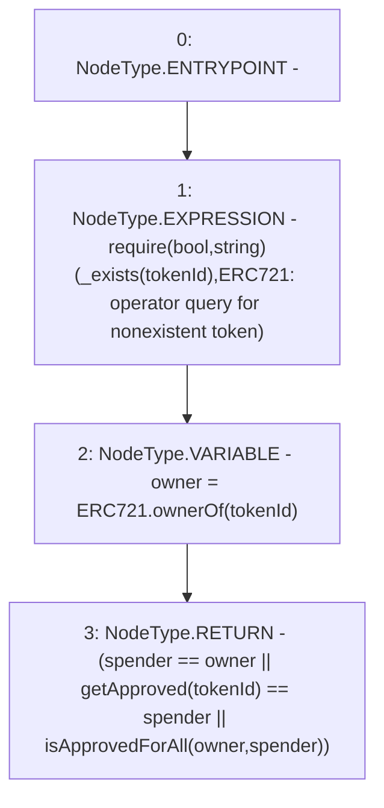

# Context: RCNftHubL1._isApprovedOrOwner

**Contract:** `RCNftHubL1` (Inherits: IRCNftHubL1, NativeMetaTransaction, AccessControl, ERC721URIStorage, ERC721, IERC721Metadata, IERC721, ERC165, IERC165, IAccessControl, Ownable, Context)
**Signature:** `_isApprovedOrOwner(address,uint256) returns (bool)`
**Method Selector ID:** `Internal (No Method ID)`
**Visibility:** `internal`
**Environment-Free:** `Yes`
**Modifiers:** None

### State Variables Interaction
- **Reads:** None
- **Writes:** None

### Assertion Checks & Business Requirements
- require/assert: `require(bool,string)(_exists(tokenId),ERC721: operator query for nonexistent token)`

### Environment & Verification Flags
- **Uses Foundry Cheatcodes:** No
- **Has Echidna Properties:** No

### Internal Calls Tree
- None

### External Calls / Value Transfers
- None

### Control Flow Graph (CFG)


### Source Mapping
Declared in: `node_modules/@openzeppelin/contracts/token/ERC721/ERC721.sol` on lines **215** to **219**

```solidity
    function _isApprovedOrOwner(address spender, uint256 tokenId) internal view virtual returns (bool) {
        require(_exists(tokenId), "ERC721: operator query for nonexistent token");
        address owner = ERC721.ownerOf(tokenId);
        return (spender == owner || getApproved(tokenId) == spender || isApprovedForAll(owner, spender));
    }

```
