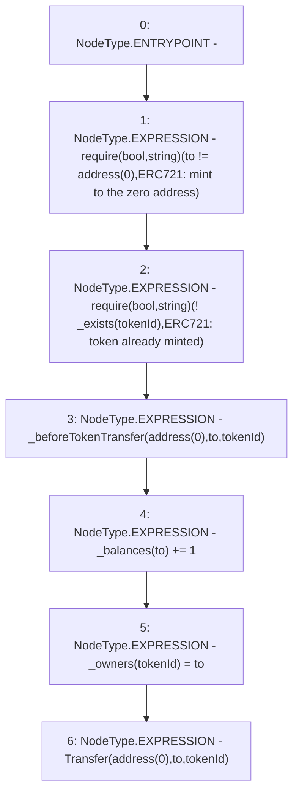

# Context: RCNftHubL1._mint

**Contract:** `RCNftHubL1` (Inherits: IRCNftHubL1, NativeMetaTransaction, AccessControl, ERC721URIStorage, ERC721, IERC721Metadata, IERC721, ERC165, IERC165, IAccessControl, Ownable, Context)
**Signature:** `_mint(address,uint256)`
**Method Selector ID:** `Internal (No Method ID)`
**Visibility:** `internal`
**Environment-Free:** `Yes`
**Modifiers:** None

### State Variables Interaction
- **Reads:** _balances
- **Writes:** _balances, _owners

### Assertion Checks & Business Requirements
- require/assert: `require(bool,string)(to != address(0),ERC721: mint to the zero address)`
- require/assert: `require(bool,string)(! _exists(tokenId),ERC721: token already minted)`

### Environment & Verification Flags
- **Uses Foundry Cheatcodes:** No
- **Has Echidna Properties:** No

### Internal Calls Tree
- None

### External Calls / Value Transfers
- None

### Control Flow Graph (CFG)


### Source Mapping
Declared in: `node_modules/@openzeppelin/contracts/token/ERC721/ERC721.sol` on lines **256** to **266**

```solidity
    function _mint(address to, uint256 tokenId) internal virtual {
        require(to != address(0), "ERC721: mint to the zero address");
        require(!_exists(tokenId), "ERC721: token already minted");

        _beforeTokenTransfer(address(0), to, tokenId);

        _balances[to] += 1;
        _owners[tokenId] = to;

        emit Transfer(address(0), to, tokenId);
    }

```
