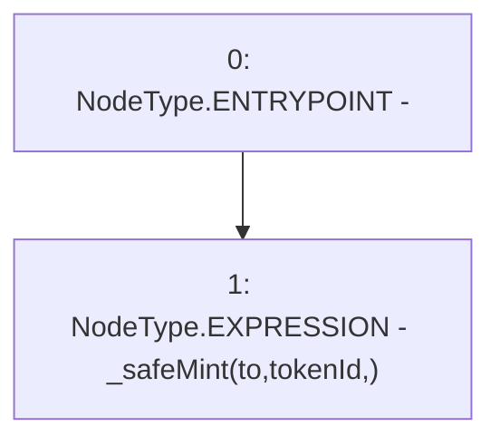

# Context: RCNftHubL1._safeMint

**Contract:** `RCNftHubL1` (Inherits: IRCNftHubL1, NativeMetaTransaction, AccessControl, ERC721URIStorage, ERC721, IERC721Metadata, IERC721, ERC165, IERC165, IAccessControl, Ownable, Context)
**Signature:** `_safeMint(address,uint256)`
**Method Selector ID:** `Internal (No Method ID)`
**Visibility:** `internal`
**Environment-Free:** `No (reads EVM state context)`
**Modifiers:** None

### State Variables Interaction
- **Reads:** None
- **Writes:** None

### Environment & Verification Flags
- **Uses Foundry Cheatcodes:** No
- **Has Echidna Properties:** No

### Internal Calls Tree
- None

### External Calls / Value Transfers
- None

### Control Flow Graph (CFG)


### Source Mapping
Declared in: `node_modules/@openzeppelin/contracts/token/ERC721/ERC721.sol` on lines **231** to **233**

```solidity
    function _safeMint(address to, uint256 tokenId) internal virtual {
        _safeMint(to, tokenId, "");
    }

```
