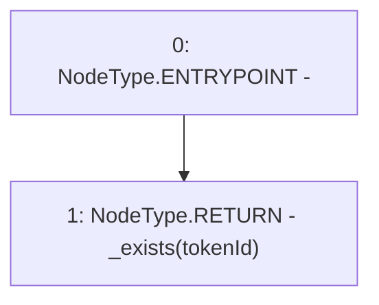

# Context: RCNftHubL1.exists

**Contract:** `RCNftHubL1` (Inherits: IRCNftHubL1, NativeMetaTransaction, AccessControl, ERC721URIStorage, ERC721, IERC721Metadata, IERC721, ERC165, IERC165, IAccessControl, Ownable, Context)
**Signature:** `exists(uint256) returns (bool)`
**Method Selector ID:** `0x4f558e79`
**Visibility:** `external`
**Environment-Free:** `Yes`
**Modifiers:** None

### State Variables Interaction
- **Reads:** None
- **Writes:** None

### Environment & Verification Flags
- **Uses Foundry Cheatcodes:** No
- **Has Echidna Properties:** No

### Internal Calls Tree
- None

### External Calls / Value Transfers
- None

### Control Flow Graph (CFG)


### Source Mapping
Declared in: `contracts/nfthubs/RCNftHubL1.sol` on lines **68** to **70**

```solidity
    function exists(uint256 tokenId) external view override returns (bool) {
        return _exists(tokenId);
    }

```
