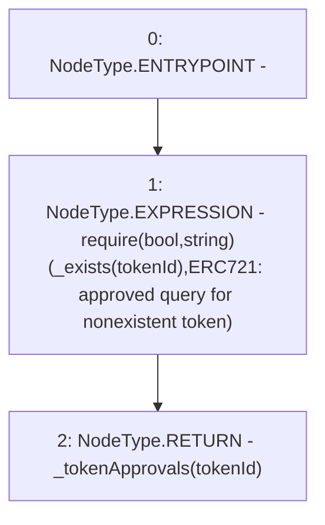

# Context: RCNftHubL1.getApproved

**Contract:** `RCNftHubL1` (Inherits: IRCNftHubL1, NativeMetaTransaction, AccessControl, ERC721URIStorage, ERC721, IERC721Metadata, IERC721, ERC165, IERC165, IAccessControl, Ownable, Context)
**Signature:** `getApproved(uint256) returns (address)`
**Method Selector ID:** `0x081812fc`
**Visibility:** `public`
**Environment-Free:** `Yes`
**Modifiers:** None

### State Variables Interaction
- **Reads:** _tokenApprovals
- **Writes:** None

### Assertion Checks & Business Requirements
- require/assert: `require(bool,string)(_exists(tokenId),ERC721: approved query for nonexistent token)`

### Environment & Verification Flags
- **Uses Foundry Cheatcodes:** No
- **Has Echidna Properties:** No

### Internal Calls Tree
- None

### External Calls / Value Transfers
- None

### Control Flow Graph (CFG)


### Source Mapping
Declared in: `node_modules/@openzeppelin/contracts/token/ERC721/ERC721.sol` on lines **125** to **129**

```solidity
    function getApproved(uint256 tokenId) public view virtual override returns (address) {
        require(_exists(tokenId), "ERC721: approved query for nonexistent token");

        return _tokenApprovals[tokenId];
    }

```
