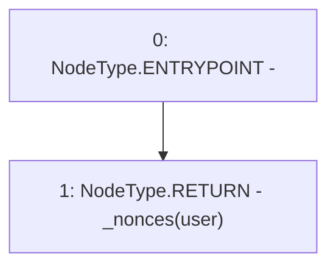

# Context: RCNftHubL1.getNonce

**Contract:** `RCNftHubL1` (Inherits: IRCNftHubL1, NativeMetaTransaction, AccessControl, ERC721URIStorage, ERC721, IERC721Metadata, IERC721, ERC165, IERC165, IAccessControl, Ownable, Context)
**Signature:** `getNonce(address) returns (uint256)`
**Method Selector ID:** `0x2d0335ab`
**Visibility:** `public`
**Environment-Free:** `Yes`
**Modifiers:** None

### State Variables Interaction
- **Reads:** _nonces
- **Writes:** None

### Environment & Verification Flags
- **Uses Foundry Cheatcodes:** No
- **Has Echidna Properties:** No

### Internal Calls Tree
- None

### External Calls / Value Transfers
- None

### Control Flow Graph (CFG)


### Source Mapping
Declared in: `contracts/lib/NativeMetaTransaction.sol` on lines **12** to **14**

```solidity
    function getNonce(address user) public view returns (uint256) {
        return _nonces[user];
    }

```
