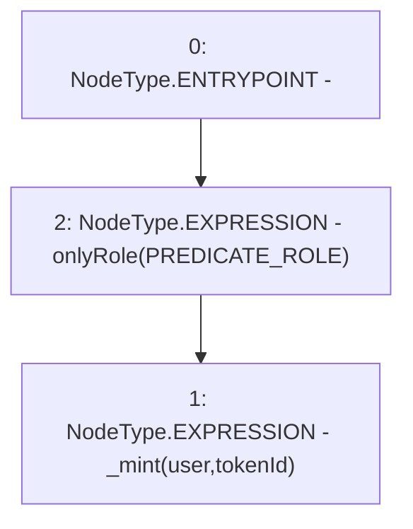

# Context: RCNftHubL1.mint

**Contract:** `RCNftHubL1` (Inherits: IRCNftHubL1, NativeMetaTransaction, AccessControl, ERC721URIStorage, ERC721, IERC721Metadata, IERC721, ERC165, IERC165, IAccessControl, Ownable, Context)
**Signature:** `mint(address,uint256)`
**Method Selector ID:** `0x40c10f19`
**Visibility:** `external`
**Environment-Free:** `No (reads EVM state context)`
**Modifiers:**
- `onlyRole`
  ```solidity
  modifier onlyRole(bytes32 role) {
          _checkRole(role, _msgSender());
          _;
      }
  ```

### State Variables Interaction
- **Reads:** PREDICATE_ROLE
- **Writes:** None

### Environment & Verification Flags
- **Uses Foundry Cheatcodes:** No
- **Has Echidna Properties:** No

### Internal Calls Tree
- None

### External Calls / Value Transfers
- None

### Control Flow Graph (CFG)


### Source Mapping
Declared in: `contracts/nfthubs/RCNftHubL1.sol` on lines **42** to **48**

```solidity
    function mint(address user, uint256 tokenId)
        external
        override
        onlyRole(PREDICATE_ROLE)
    {
        _mint(user, tokenId);
    }

```
