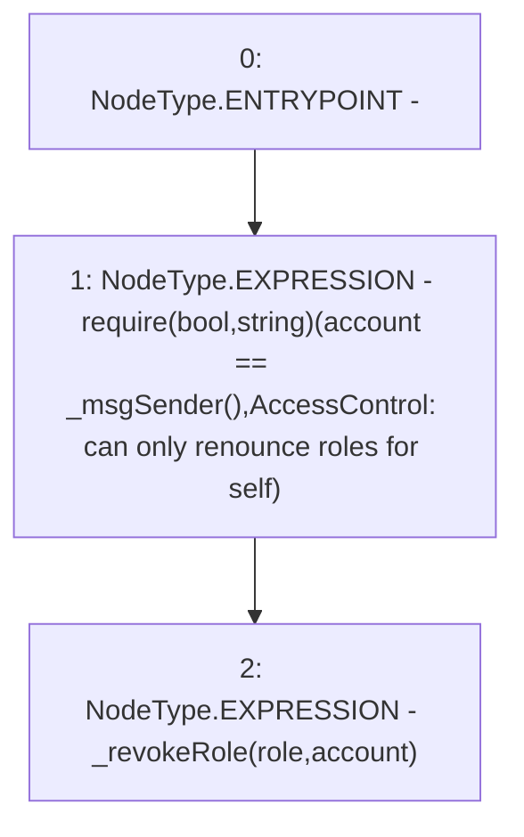

# Context: RCNftHubL1.renounceRole

**Contract:** `RCNftHubL1` (Inherits: IRCNftHubL1, NativeMetaTransaction, AccessControl, ERC721URIStorage, ERC721, IERC721Metadata, IERC721, ERC165, IERC165, IAccessControl, Ownable, Context)
**Signature:** `renounceRole(bytes32,address)`
**Method Selector ID:** `0x36568abe`
**Visibility:** `public`
**Environment-Free:** `No (reads EVM state context)`
**Modifiers:** None

### State Variables Interaction
- **Reads:** None
- **Writes:** None

### Assertion Checks & Business Requirements
- require/assert: `require(bool,string)(account == _msgSender(),AccessControl: can only renounce roles for self)`

### Environment & Verification Flags
- **Uses Foundry Cheatcodes:** No
- **Has Echidna Properties:** No

### Internal Calls Tree
- None

### External Calls / Value Transfers
- None

### Control Flow Graph (CFG)


### Source Mapping
Declared in: `node_modules/@openzeppelin/contracts/access/AccessControl.sol` on lines **194** to **198**

```solidity
    function renounceRole(bytes32 role, address account) public virtual override {
        require(account == _msgSender(), "AccessControl: can only renounce roles for self");

        _revokeRole(role, account);
    }

```
