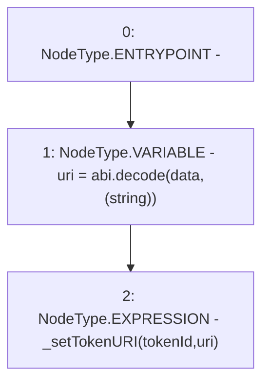

# Context: RCNftHubL1.setTokenMetadata

**Contract:** `RCNftHubL1` (Inherits: IRCNftHubL1, NativeMetaTransaction, AccessControl, ERC721URIStorage, ERC721, IERC721Metadata, IERC721, ERC165, IERC165, IAccessControl, Ownable, Context)
**Signature:** `setTokenMetadata(uint256,bytes)`
**Method Selector ID:** `Internal (No Method ID)`
**Visibility:** `internal`
**Environment-Free:** `Yes`
**Modifiers:** None

### State Variables Interaction
- **Reads:** None
- **Writes:** None

### Environment & Verification Flags
- **Uses Foundry Cheatcodes:** No
- **Has Echidna Properties:** No

### Internal Calls Tree
- None

### External Calls / Value Transfers
- None

### Control Flow Graph (CFG)


### Source Mapping
Declared in: `contracts/nfthubs/RCNftHubL1.sol` on lines **60** to **66**

```solidity
    function setTokenMetadata(uint256 tokenId, bytes memory data)
        internal
        virtual
    {
        string memory uri = abi.decode(data, (string));
        _setTokenURI(tokenId, uri);
    }

```
