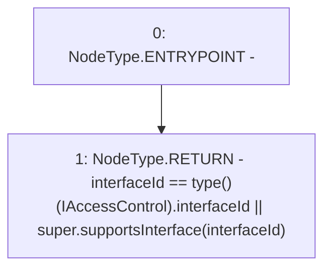

# Context: RCNftHubL1.supportsInterface

**Contract:** `RCNftHubL1` (Inherits: IRCNftHubL1, NativeMetaTransaction, AccessControl, ERC721URIStorage, ERC721, IERC721Metadata, IERC721, ERC165, IERC165, IAccessControl, Ownable, Context)
**Signature:** `supportsInterface(bytes4) returns (bool)`
**Method Selector ID:** `0x01ffc9a7`
**Visibility:** `public`
**Environment-Free:** `Yes`
**Modifiers:** None

### State Variables Interaction
- **Reads:** None
- **Writes:** None

### Environment & Verification Flags
- **Uses Foundry Cheatcodes:** No
- **Has Echidna Properties:** No

### Internal Calls Tree
- None

### External Calls / Value Transfers
- None

### Control Flow Graph (CFG)


### Source Mapping
Declared in: `node_modules/@openzeppelin/contracts/access/AccessControl.sol` on lines **113** to **116**

```solidity
    function supportsInterface(bytes4 interfaceId) public view virtual override returns (bool) {
        return interfaceId == type(IAccessControl).interfaceId
            || super.supportsInterface(interfaceId);
    }

```
