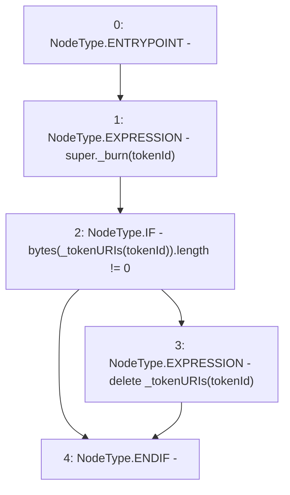

# Context: RCNftHubL2._burn

**Contract:** `RCNftHubL2` (Inherits: IRCNftHubL2, NativeMetaTransaction, AccessControl, ERC721URIStorage, ERC721, IERC721Metadata, IERC721, ERC165, IERC165, IAccessControl, Ownable, Context)
**Signature:** `_burn(uint256)`
**Method Selector ID:** `Internal (No Method ID)`
**Visibility:** `internal`
**Environment-Free:** `Yes`
**Modifiers:** None

### State Variables Interaction
- **Reads:** _tokenURIs
- **Writes:** _tokenURIs

### Environment & Verification Flags
- **Uses Foundry Cheatcodes:** No
- **Has Echidna Properties:** No

### Internal Calls Tree
- None

### External Calls / Value Transfers
- None

### Control Flow Graph (CFG)


### Source Mapping
Declared in: `node_modules/@openzeppelin/contracts/token/ERC721/extensions/ERC721URIStorage.sol` on lines **59** to **65**

```solidity
    function _burn(uint256 tokenId) internal virtual override {
        super._burn(tokenId);

        if (bytes(_tokenURIs[tokenId]).length != 0) {
            delete _tokenURIs[tokenId];
        }
    }

```
