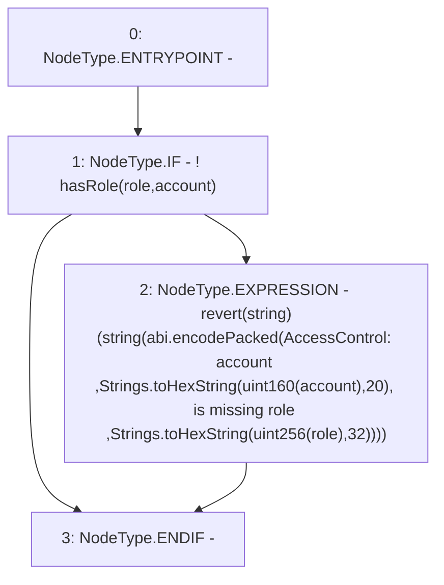

# Context: RCNftHubL2._checkRole

**Contract:** `RCNftHubL2` (Inherits: IRCNftHubL2, NativeMetaTransaction, AccessControl, ERC721URIStorage, ERC721, IERC721Metadata, IERC721, ERC165, IERC165, IAccessControl, Ownable, Context)
**Signature:** `_checkRole(bytes32,address)`
**Method Selector ID:** `Internal (No Method ID)`
**Visibility:** `internal`
**Environment-Free:** `Yes`
**Modifiers:** None

### State Variables Interaction
- **Reads:** None
- **Writes:** None

### Assertion Checks & Business Requirements
- revert: `revert(string)(string(abi.encodePacked(AccessControl: account ,Strings.toHexString(uint160(account),20), is missing role ,Strings.toHexString(uint256(role),32))))`

### Environment & Verification Flags
- **Uses Foundry Cheatcodes:** No
- **Has Echidna Properties:** No

### Internal Calls Tree
- None

### External Calls / Value Transfers
- `Strings.TMP_2060(string) = LIBRARY_CALL, dest:Strings, function:Strings.toHexString(uint256,uint256), arguments:['TMP_2059', '20'] `
- `Strings.TMP_2062(string) = LIBRARY_CALL, dest:Strings, function:Strings.toHexString(uint256,uint256), arguments:['TMP_2061', '32'] `

### Control Flow Graph (CFG)


### Source Mapping
Declared in: `node_modules/@openzeppelin/contracts/access/AccessControl.sol` on lines **132** to **141**

```solidity
    function _checkRole(bytes32 role, address account) internal view {
        if(!hasRole(role, account)) {
            revert(string(abi.encodePacked(
                "AccessControl: account ",
                Strings.toHexString(uint160(account), 20),
                " is missing role ",
                Strings.toHexString(uint256(role), 32)
            )));
        }
    }

```
