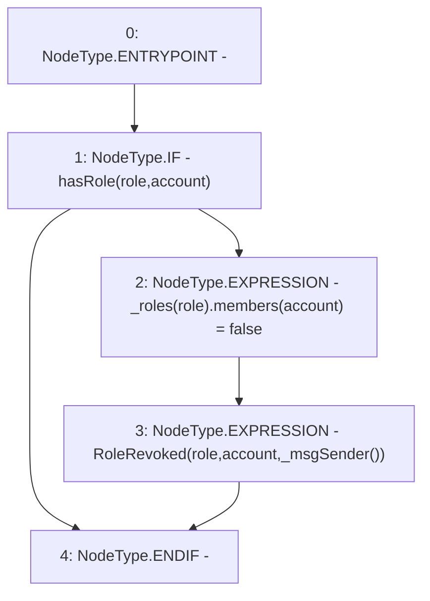

# Context: RCNftHubL2._revokeRole

**Contract:** `RCNftHubL2` (Inherits: IRCNftHubL2, NativeMetaTransaction, AccessControl, ERC721URIStorage, ERC721, IERC721Metadata, IERC721, ERC165, IERC165, IAccessControl, Ownable, Context)
**Signature:** `_revokeRole(bytes32,address)`
**Method Selector ID:** `Internal (No Method ID)`
**Visibility:** `private`
**Environment-Free:** `No (reads EVM state context)`
**Modifiers:** None

### State Variables Interaction
- **Reads:** _roles
- **Writes:** _roles

### Environment & Verification Flags
- **Uses Foundry Cheatcodes:** No
- **Has Echidna Properties:** No

### Internal Calls Tree
- None

### External Calls / Value Transfers
- None

### Control Flow Graph (CFG)


### Source Mapping
Declared in: `node_modules/@openzeppelin/contracts/access/AccessControl.sol` on lines **237** to **242**

```solidity
    function _revokeRole(bytes32 role, address account) private {
        if (hasRole(role, account)) {
            _roles[role].members[account] = false;
            emit RoleRevoked(role, account, _msgSender());
        }
    }

```
