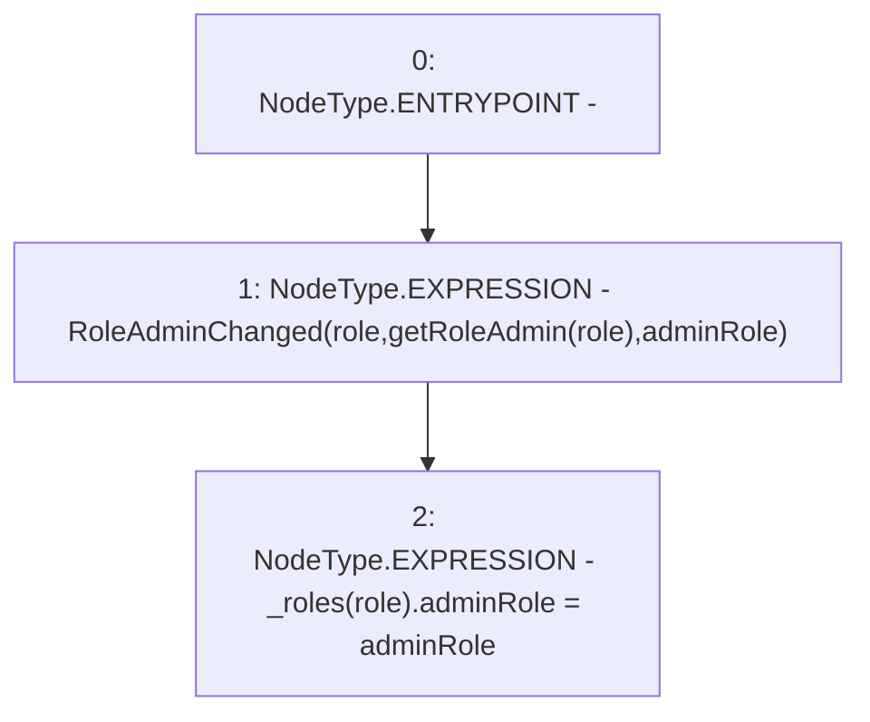

# Context: RCNftHubL2._setRoleAdmin

**Contract:** `RCNftHubL2` (Inherits: IRCNftHubL2, NativeMetaTransaction, AccessControl, ERC721URIStorage, ERC721, IERC721Metadata, IERC721, ERC165, IERC165, IAccessControl, Ownable, Context)
**Signature:** `_setRoleAdmin(bytes32,bytes32)`
**Method Selector ID:** `Internal (No Method ID)`
**Visibility:** `internal`
**Environment-Free:** `Yes`
**Modifiers:** None

### State Variables Interaction
- **Reads:** _roles
- **Writes:** _roles

### Environment & Verification Flags
- **Uses Foundry Cheatcodes:** No
- **Has Echidna Properties:** No

### Internal Calls Tree
- None

### External Calls / Value Transfers
- None

### Control Flow Graph (CFG)


### Source Mapping
Declared in: `node_modules/@openzeppelin/contracts/access/AccessControl.sol` on lines **225** to **228**

```solidity
    function _setRoleAdmin(bytes32 role, bytes32 adminRole) internal virtual {
        emit RoleAdminChanged(role, getRoleAdmin(role), adminRole);
        _roles[role].adminRole = adminRole;
    }

```
