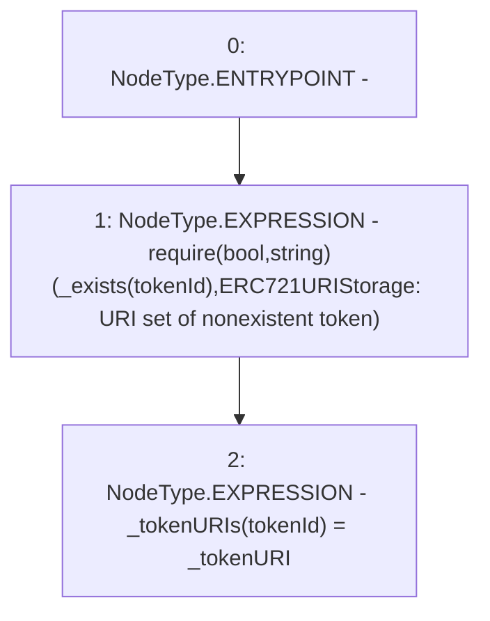

# Context: RCNftHubL2._setTokenURI

**Contract:** `RCNftHubL2` (Inherits: IRCNftHubL2, NativeMetaTransaction, AccessControl, ERC721URIStorage, ERC721, IERC721Metadata, IERC721, ERC165, IERC165, IAccessControl, Ownable, Context)
**Signature:** `_setTokenURI(uint256,string)`
**Method Selector ID:** `Internal (No Method ID)`
**Visibility:** `internal`
**Environment-Free:** `Yes`
**Modifiers:** None

### State Variables Interaction
- **Reads:** None
- **Writes:** _tokenURIs

### Assertion Checks & Business Requirements
- require/assert: `require(bool,string)(_exists(tokenId),ERC721URIStorage: URI set of nonexistent token)`

### Environment & Verification Flags
- **Uses Foundry Cheatcodes:** No
- **Has Echidna Properties:** No

### Internal Calls Tree
- None

### External Calls / Value Transfers
- None

### Control Flow Graph (CFG)


### Source Mapping
Declared in: `node_modules/@openzeppelin/contracts/token/ERC721/extensions/ERC721URIStorage.sol` on lines **44** to **47**

```solidity
    function _setTokenURI(uint256 tokenId, string memory _tokenURI) internal virtual {
        require(_exists(tokenId), "ERC721URIStorage: URI set of nonexistent token");
        _tokenURIs[tokenId] = _tokenURI;
    }

```
