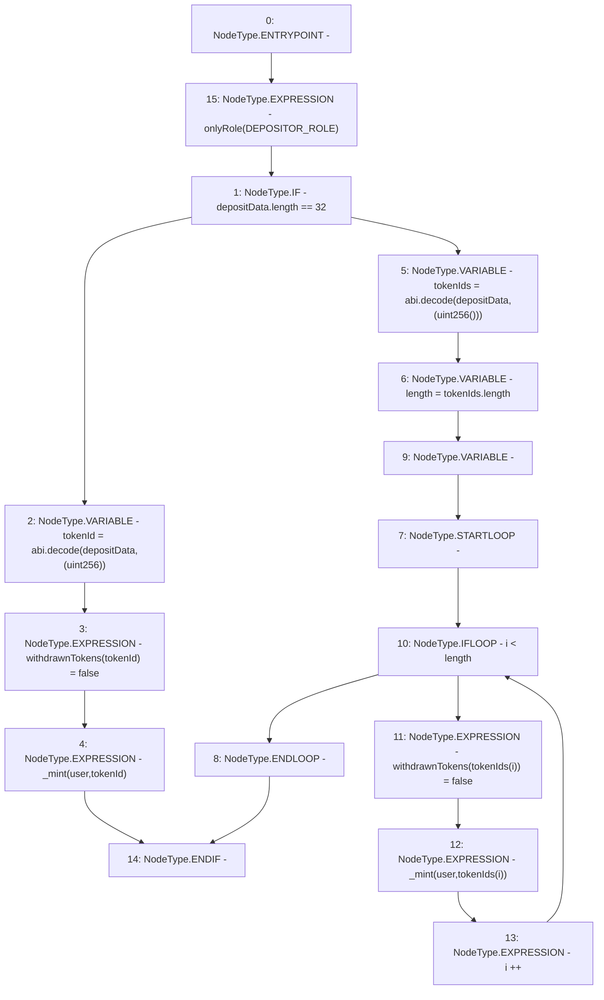

# Context: RCNftHubL2.deposit

**Contract:** `RCNftHubL2` (Inherits: IRCNftHubL2, NativeMetaTransaction, AccessControl, ERC721URIStorage, ERC721, IERC721Metadata, IERC721, ERC165, IERC165, IAccessControl, Ownable, Context)
**Signature:** `deposit(address,bytes)`
**Method Selector ID:** `0xcf2c52cb`
**Visibility:** `external`
**Environment-Free:** `No (reads EVM state context)`
**Modifiers:**
- `onlyRole`
  ```solidity
  modifier onlyRole(bytes32 role) {
          _checkRole(role, _msgSender());
          _;
      }
  ```

### State Variables Interaction
- **Reads:** DEPOSITOR_ROLE
- **Writes:** withdrawnTokens

### Environment & Verification Flags
- **Uses Foundry Cheatcodes:** No
- **Has Echidna Properties:** No

### Internal Calls Tree
- None

### External Calls / Value Transfers
- None

### Control Flow Graph (CFG)


### Source Mapping
Declared in: `contracts/nfthubs/RCNftHubL2.sol` on lines **135** to **155**

```solidity
    function deposit(address user, bytes calldata depositData)
        external
        override
        onlyRole(DEPOSITOR_ROLE)
    {
        // deposit single
        if (depositData.length == 32) {
            uint256 tokenId = abi.decode(depositData, (uint256));
            withdrawnTokens[tokenId] = false;
            _mint(user, tokenId);

            // deposit batch
        } else {
            uint256[] memory tokenIds = abi.decode(depositData, (uint256[]));
            uint256 length = tokenIds.length;
            for (uint256 i; i < length; i++) {
                withdrawnTokens[tokenIds[i]] = false;
                _mint(user, tokenIds[i]);
            }
        }
    }

```
