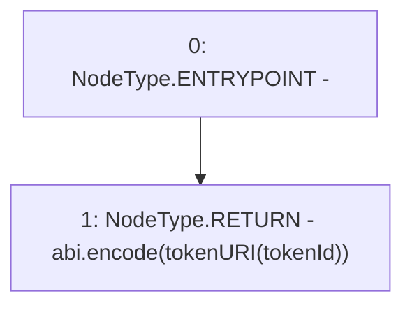

# Context: RCNftHubL2.encodeTokenMetadata

**Contract:** `RCNftHubL2` (Inherits: IRCNftHubL2, NativeMetaTransaction, AccessControl, ERC721URIStorage, ERC721, IERC721Metadata, IERC721, ERC165, IERC165, IAccessControl, Ownable, Context)
**Signature:** `encodeTokenMetadata(uint256) returns (bytes)`
**Method Selector ID:** `0x1653c39a`
**Visibility:** `external`
**Environment-Free:** `Yes`
**Modifiers:** None

### State Variables Interaction
- **Reads:** None
- **Writes:** None

### Environment & Verification Flags
- **Uses Foundry Cheatcodes:** No
- **Has Echidna Properties:** No

### Internal Calls Tree
- None

### External Calls / Value Transfers
- None

### Control Flow Graph (CFG)


### Source Mapping
Declared in: `contracts/nfthubs/RCNftHubL2.sol` on lines **186** to **193**

```solidity
    function encodeTokenMetadata(uint256 tokenId)
        external
        view
        virtual
        returns (bytes memory)
    {
        return abi.encode(tokenURI(tokenId));
    }

```
