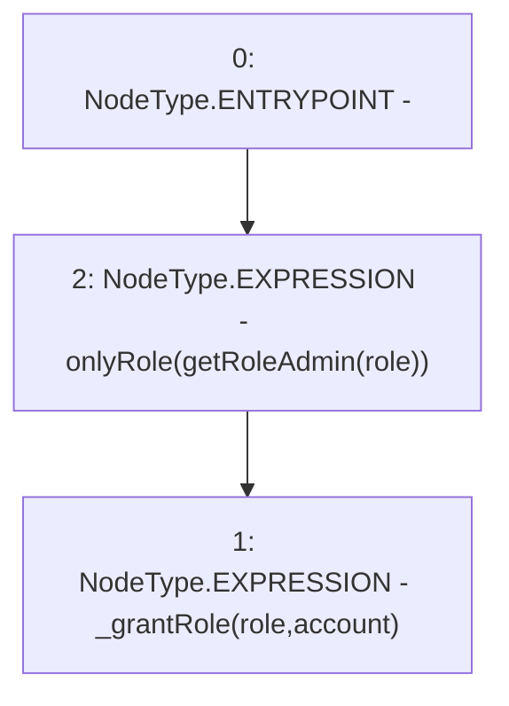

# Context: RCNftHubL2.grantRole

**Contract:** `RCNftHubL2` (Inherits: IRCNftHubL2, NativeMetaTransaction, AccessControl, ERC721URIStorage, ERC721, IERC721Metadata, IERC721, ERC165, IERC165, IAccessControl, Ownable, Context)
**Signature:** `grantRole(bytes32,address)`
**Method Selector ID:** `0x2f2ff15d`
**Visibility:** `public`
**Environment-Free:** `No (reads EVM state context)`
**Modifiers:**
- `onlyRole`
  ```solidity
  modifier onlyRole(bytes32 role) {
          _checkRole(role, _msgSender());
          _;
      }
  ```

### State Variables Interaction
- **Reads:** None
- **Writes:** None

### Environment & Verification Flags
- **Uses Foundry Cheatcodes:** No
- **Has Echidna Properties:** No

### Internal Calls Tree
- None

### External Calls / Value Transfers
- None

### Control Flow Graph (CFG)


### Source Mapping
Declared in: `node_modules/@openzeppelin/contracts/access/AccessControl.sol` on lines **163** to **165**

```solidity
    function grantRole(bytes32 role, address account) public virtual override onlyRole(getRoleAdmin(role)) {
        _grantRole(role, account);
    }

```
