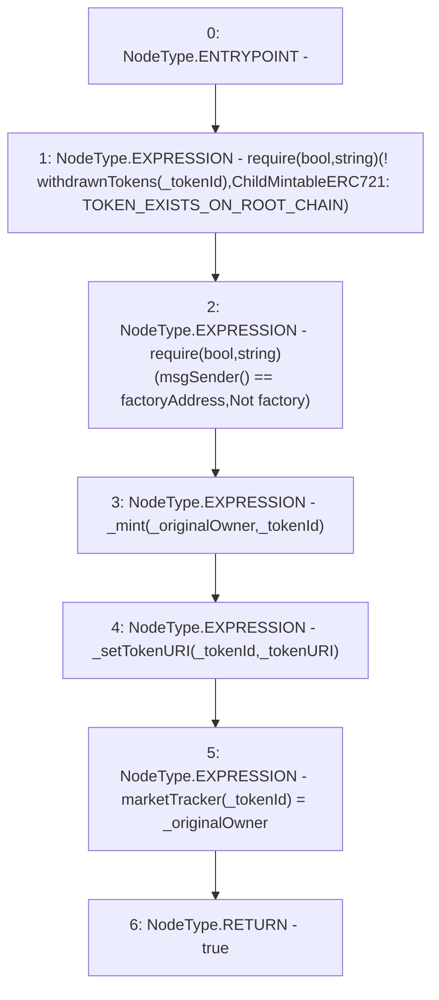

# Context: RCNftHubL2.mint

**Contract:** `RCNftHubL2` (Inherits: IRCNftHubL2, NativeMetaTransaction, AccessControl, ERC721URIStorage, ERC721, IERC721Metadata, IERC721, ERC165, IERC165, IAccessControl, Ownable, Context)
**Signature:** `mint(address,uint256,string) returns (bool)`
**Method Selector ID:** `0xd3fc9864`
**Visibility:** `external`
**Environment-Free:** `No (reads EVM state context)`
**Modifiers:** None

### State Variables Interaction
- **Reads:** factoryAddress, withdrawnTokens
- **Writes:** marketTracker

### Assertion Checks & Business Requirements
- require/assert: `require(bool,string)(! withdrawnTokens[_tokenId],ChildMintableERC721: TOKEN_EXISTS_ON_ROOT_CHAIN)`
- require/assert: `require(bool,string)(msgSender() == factoryAddress,Not factory)`

### Environment & Verification Flags
- **Uses Foundry Cheatcodes:** No
- **Has Echidna Properties:** No

### Internal Calls Tree
- None

### External Calls / Value Transfers
- None

### Control Flow Graph (CFG)


### Source Mapping
Declared in: `contracts/nfthubs/RCNftHubL2.sol` on lines **84** to **98**

```solidity
    function mint(
        address _originalOwner,
        uint256 _tokenId,
        string calldata _tokenURI
    ) external override returns (bool) {
        require(
            !withdrawnTokens[_tokenId],
            "ChildMintableERC721: TOKEN_EXISTS_ON_ROOT_CHAIN"
        );
        require(msgSender() == factoryAddress, "Not factory");
        _mint(_originalOwner, _tokenId);
        _setTokenURI(_tokenId, _tokenURI);
        marketTracker[_tokenId] = _originalOwner;
        return true;
    }

```
