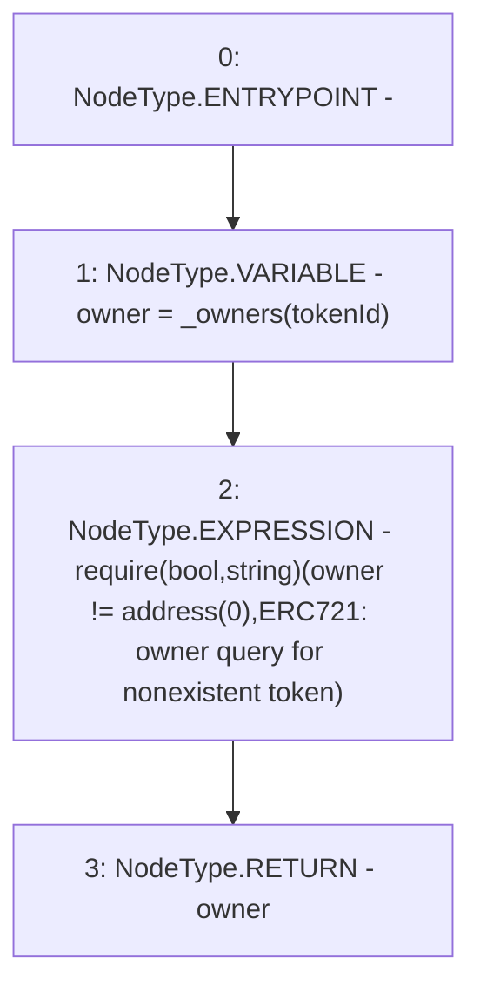

# Context: RCNftHubL2.ownerOf

**Contract:** `RCNftHubL2` (Inherits: IRCNftHubL2, NativeMetaTransaction, AccessControl, ERC721URIStorage, ERC721, IERC721Metadata, IERC721, ERC165, IERC165, IAccessControl, Ownable, Context)
**Signature:** `ownerOf(uint256) returns (address)`
**Method Selector ID:** `0x6352211e`
**Visibility:** `public`
**Environment-Free:** `Yes`
**Modifiers:** None

### State Variables Interaction
- **Reads:** _owners
- **Writes:** None

### Assertion Checks & Business Requirements
- require/assert: `require(bool,string)(owner != address(0),ERC721: owner query for nonexistent token)`

### Environment & Verification Flags
- **Uses Foundry Cheatcodes:** No
- **Has Echidna Properties:** No

### Internal Calls Tree
- None

### External Calls / Value Transfers
- None

### Control Flow Graph (CFG)


### Source Mapping
Declared in: `node_modules/@openzeppelin/contracts/token/ERC721/ERC721.sol` on lines **68** to **72**

```solidity
    function ownerOf(uint256 tokenId) public view virtual override returns (address) {
        address owner = _owners[tokenId];
        require(owner != address(0), "ERC721: owner query for nonexistent token");
        return owner;
    }

```
