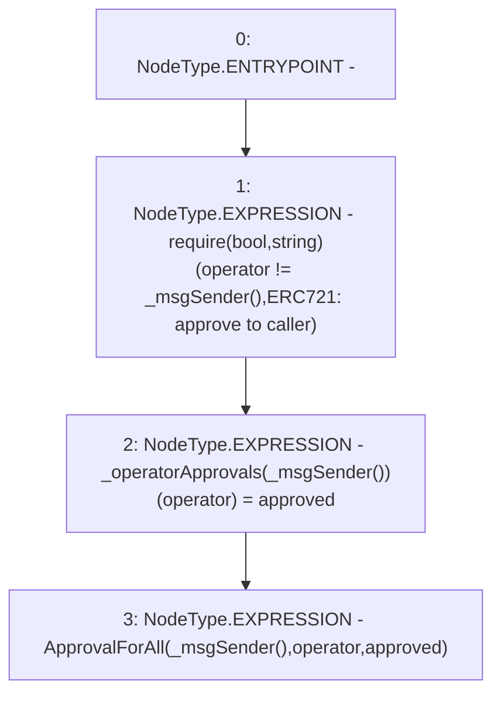

# Context: RCNftHubL2.setApprovalForAll

**Contract:** `RCNftHubL2` (Inherits: IRCNftHubL2, NativeMetaTransaction, AccessControl, ERC721URIStorage, ERC721, IERC721Metadata, IERC721, ERC165, IERC165, IAccessControl, Ownable, Context)
**Signature:** `setApprovalForAll(address,bool)`
**Method Selector ID:** `0xa22cb465`
**Visibility:** `public`
**Environment-Free:** `No (reads EVM state context)`
**Modifiers:** None

### State Variables Interaction
- **Reads:** None
- **Writes:** _operatorApprovals

### Assertion Checks & Business Requirements
- require/assert: `require(bool,string)(operator != _msgSender(),ERC721: approve to caller)`

### Environment & Verification Flags
- **Uses Foundry Cheatcodes:** No
- **Has Echidna Properties:** No

### Internal Calls Tree
- None

### External Calls / Value Transfers
- None

### Control Flow Graph (CFG)


### Source Mapping
Declared in: `node_modules/@openzeppelin/contracts/token/ERC721/ERC721.sol` on lines **134** to **139**

```solidity
    function setApprovalForAll(address operator, bool approved) public virtual override {
        require(operator != _msgSender(), "ERC721: approve to caller");

        _operatorApprovals[_msgSender()][operator] = approved;
        emit ApprovalForAll(_msgSender(), operator, approved);
    }

```
