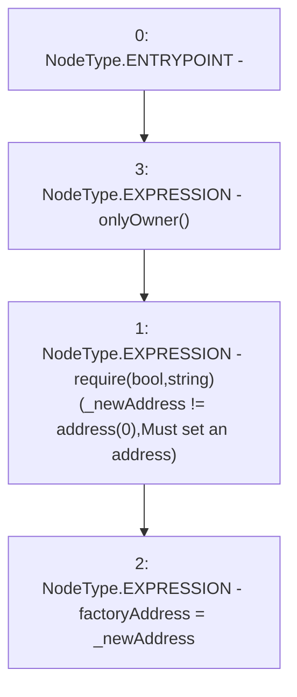

# Context: RCNftHubL2.setFactoryAddress

**Contract:** `RCNftHubL2` (Inherits: IRCNftHubL2, NativeMetaTransaction, AccessControl, ERC721URIStorage, ERC721, IERC721Metadata, IERC721, ERC165, IERC165, IAccessControl, Ownable, Context)
**Signature:** `setFactoryAddress(address)`
**Method Selector ID:** `0x83c17c55`
**Visibility:** `public`
**Environment-Free:** `No (reads EVM state context)`
**Modifiers:**
- `onlyOwner`
  ```solidity
  modifier onlyOwner() {
          require(owner() == _msgSender(), "Ownable: caller is not the owner");
          _;
      }
  ```

### State Variables Interaction
- **Reads:** None
- **Writes:** factoryAddress

### Assertion Checks & Business Requirements
- require/assert: `require(bool,string)(_newAddress != address(0),Must set an address)`

### Environment & Verification Flags
- **Uses Foundry Cheatcodes:** No
- **Has Echidna Properties:** No

### Internal Calls Tree
- None

### External Calls / Value Transfers
- None

### Control Flow Graph (CFG)


### Source Mapping
Declared in: `contracts/nfthubs/RCNftHubL2.sol` on lines **74** to **77**

```solidity
    function setFactoryAddress(address _newAddress) public onlyOwner {
        require(_newAddress != address(0), "Must set an address");
        factoryAddress = _newAddress;
    }

```
