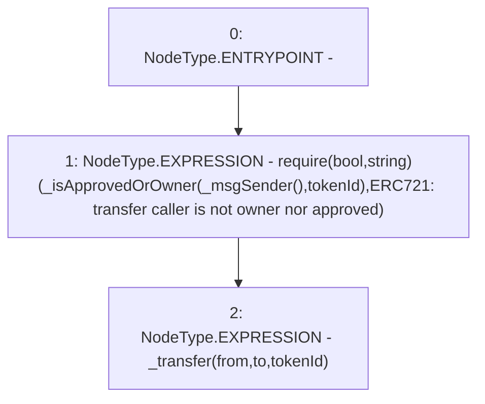

# Context: RCNftHubL2.transferFrom

**Contract:** `RCNftHubL2` (Inherits: IRCNftHubL2, NativeMetaTransaction, AccessControl, ERC721URIStorage, ERC721, IERC721Metadata, IERC721, ERC165, IERC165, IAccessControl, Ownable, Context)
**Signature:** `transferFrom(address,address,uint256)`
**Method Selector ID:** `0x23b872dd`
**Visibility:** `public`
**Environment-Free:** `No (reads EVM state context)`
**Modifiers:** None

### State Variables Interaction
- **Reads:** None
- **Writes:** None

### Assertion Checks & Business Requirements
- require/assert: `require(bool,string)(_isApprovedOrOwner(_msgSender(),tokenId),ERC721: transfer caller is not owner nor approved)`

### Environment & Verification Flags
- **Uses Foundry Cheatcodes:** No
- **Has Echidna Properties:** No

### Internal Calls Tree
- None

### External Calls / Value Transfers
- `TMP_2144(None) = SOLIDITY_CALL require(bool,string)(TMP_2143,ERC721: transfer caller is not owner nor approved)`

### Control Flow Graph (CFG)


### Source Mapping
Declared in: `node_modules/@openzeppelin/contracts/token/ERC721/ERC721.sol` on lines **151** to **156**

```solidity
    function transferFrom(address from, address to, uint256 tokenId) public virtual override {
        //solhint-disable-next-line max-line-length
        require(_isApprovedOrOwner(_msgSender(), tokenId), "ERC721: transfer caller is not owner nor approved");

        _transfer(from, to, tokenId);
    }

```
